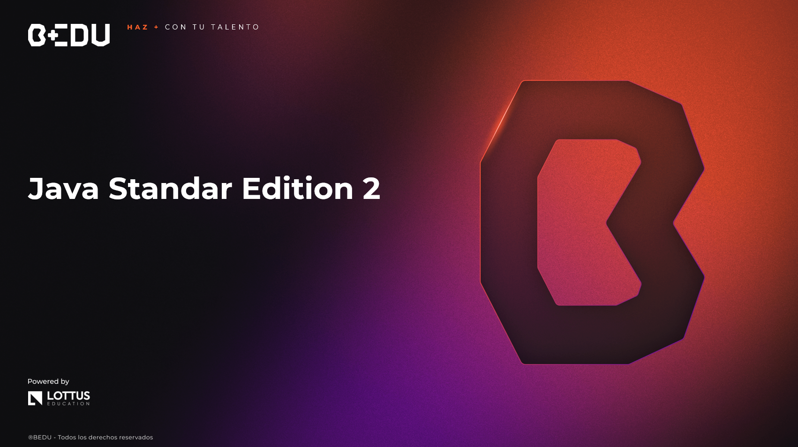

    

# 🚀 Curso de Java Standard Edition 2

## 🎯 Objetivo del Curso  
🟡 Aprender conceptos avanzados de Java tales como programación funcional, concurrencia, asincronía, bases de datos y microservicios, aplicando buenas prácticas para el desarrollo de software escalable y moderno.

## 📘 Prework

| #  | Sesión |
|----|--------|
| 09 | 🛠️ [Gestión de bases de datos](Sesion-09/Prework/Readme.md) |
| 10 | 🧵 [Multithreading y procesamiento concurrente](Sesion-10/Prework/Readme.md) |
| 11 | 🧠 [Programación funcional](Sesion-11/Prework/Readme.md) |
| 12 | 🌀 [Procesos asíncronos](Sesion-12/Prework/Readme.md) |
| 13 | 🌊 [Streams reactivos](Sesion-13/Prework/Readme.md) |
| 14 | 🧬 [Clases genéricas](Sesion-14/Prework/Readme.md) |
| 15 | 🧩 [Microservicios](Sesion-15/Prework/Readme.md) |
| 16 | ✅ [Buenas prácticas](Sesion-16/Prework/Readme.md) |

## 📚 Sesiones

| #  | Sesión |
|----|--------|
| 09 | 🛠️ [Gestión de bases de datos](Sesion-09/Readme.md) |
| 10 | 🧵 [Multithreading y procesamiento concurrente](Sesion-10/Readme.md) |
| 11 | 🧠 [Programación funcional](Sesion-11/Readme.md) |
| 12 | 🌀 [Procesos asíncronos](Sesion-12/Readme.md) |
| 13 | 🌊 [Streams reactivos](Sesion-13/Readme.md) |
| 14 | 🧬 [Clases genéricas](Sesion-14/Readme.md) |
| 15 | 🧩 [Microservicios](Sesion-15/Readme.md) |
| 16 | ✅ [Buenas prácticas](Sesion-16/Readme.md) |

---

🏆 ¡Mucho éxito! Nos vemos en la siguiente sesión.

---
