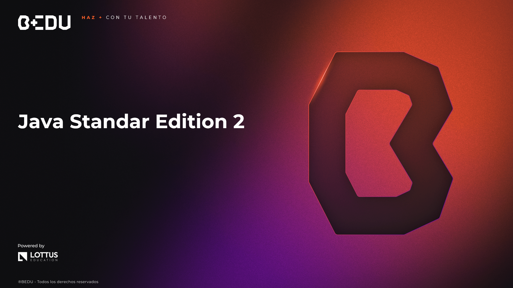

    

# 🚀 Curso de Java Standard Edition 2

## 🎯 Objetivo del Curso  
🟡 Aprender conceptos avanzados de Java tales como programación funcional, concurrencia, asincronía, bases de datos y microservicios, aplicando buenas prácticas para el desarrollo de software escalable y moderno.

## 📘 Prework

| #  | Sesión |
|----|--------|
| 01 | 🧬 [Clases genéricas](Sesion-01/Prework/Readme.md) |
| 02 | 🧵 [Multithreading y procesamiento concurrente](Sesion-02/Prework/Readme.md) |
| 03 | 🧠 [Programación funcional](Sesion-03/Prework/Readme.md) |
| 04 | 🌀 [Procesos asíncronos](Sesion-04/Prework/Readme.md) |
| 05 | 🌊 [Streams reactivos](Sesion-05/Prework/Readme.md) |
| 06 | 🛠️ [Gestión de bases de datos](Sesion-06/Prework/Readme.md) |
| 07 | 🧩 [Microservicios](Sesion-07/Prework/Readme.md) |
| 08 | ✅ [Buenas prácticas](Sesion-08/Prework/Readme.md) |
| 09 | 🧭 [Mentorship 1](Sesion-09/Prework/Readme.md) |
| 10 | 🔄 [Mentorship 2](Sesion-10/Prework/Readme.md) |

## 📚 Sesiones

| #  | Sesión |
|----|--------|
| 01 | 🧬 [Clases genéricas](Sesion-01/Readme.md) |
| 02 | 🧵 [Multithreading y procesamiento concurrente](Sesion-02/Readme.md) |
| 03 | 🧠 [Programación funcional](Sesion-03/Readme.md) |
| 04 | 🌀 [Procesos asíncronos](Sesion-04/Readme.md) |
| 05 | 🌊 [Streams reactivos](Sesion-05/Readme.md) |
| 06 | 🛠️ [Gestión de bases de datos](Sesion-06/Readme.md) |
| 07 | 🧩 [Microservicios](Sesion-07/Readme.md) |
| 08 | ✅ [Buenas prácticas](Sesion-08/Readme.md) |
| 09 | 🔁 [Mentorship 1](Sesion-09/Readme.md) |
| 10 | 🎯 [Mentorship 2](Sesion-10/Readme.md) |

---

🏆 ¡Mucho éxito! Nos vemos en la siguiente sesión.

---
