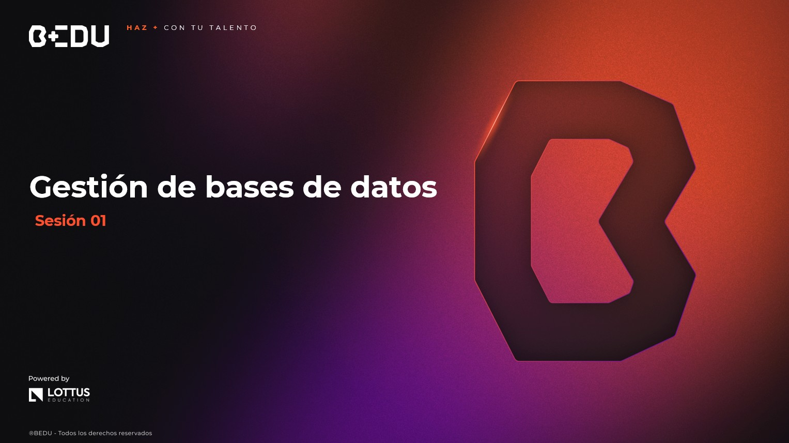

🏠 [**Inicio**](../../Readme.md) ➡️ / 📖 `Prework sesión 01`

<div align="center">
    
</div>

##### **PREWORK**
#### **🟧 Sesión 01**
#### **Gestión de bases de datos**


##### 🔶 **Introducción**

¡Hola! Bienvenido/a a una nueva etapa de tu aprendizaje en Java.

En esta sesión empezarás a conectar tus aplicaciones con algo que se usa todos los días en la vida real: **las bases de datos**.

¿Te imaginas una app como Spotify, Netflix o un sistema escolar sin guardar datos?

Con lo que aprenderás hoy, podrás conectar tu código con una base de datos real y manipularla desde Java. Vas a conocer las herramientas que hacen esto posible, desde las más básicas hasta las más modernas (como Spring Boot con JPA).

Y lo mejor: no necesitas ser experto en SQL para comenzar. 🚀


---

#### 🎯 Objetivo

- Comprender cómo Java se comunica con una base de datos utilizando JDBC y ORM.
- Configurar una base de datos embebida (H2) para pruebas rápidas.
- Integrar Hibernate y JPA en un proyecto con Spring Boot.
- Realizar operaciones CRUD desde una aplicación Java hacia la base de datos.
- Probar tus endpoints conectados usando Postman.

---

#### 📋 Instrucciones

Este Prework está diseñado para conocer el contenido que se practicará durante la sesión en vivo. **Por favor no lo omitas.**

Toma notas de lo que consideres relevante y guarda tus preguntas o dudas para resolverlas en la sesión.

Antes de comenzar es importante que preparemos nuestro ambiente de trabajo. Para desarrollar en Java, necesitaremos dos herramientas clave: 

**🖥️ IntelliJ IDEA Community Edition**

Es un entorno de desarrollo integrado (IDE) diseñado para facilitar la programación en Java. Proporciona herramientas avanzadas para escribir, depurar y ejecutar código de manera eficiente. Su versión Community Edition es gratuita y ofrece características esenciales como autocompletado, navegación inteligente y depuración visual.

**✅ ¿Por qué instalarlo?**
- Facilita la escritura de código con sugerencias y autocompletado.
- Permite detectar errores antes de ejecutar el programa.
- Integra herramientas para pruebas y depuración.
- Es ampliamente utilizado en la industria y recomendado para desarrolladores Java.

💡 Antes de descargarlo, asegúrate de elegir el enlace correcto según tu sistema operativo:

🔹 Windows 👉 (https://www.jetbrains.com/es-es/idea/download/?section=windows)  
🔹 Mac 🍏 👉 (https://www.jetbrains.com/es-es/idea/download/?section=mac)  
🔹 Linux 🐧 👉 (https://www.jetbrains.com/es-es/idea/download/?section=linux)  

**📌 Recuerda**: La instalación puede variar un poco según el sistema operativo, pero no te preocupes, el asistente de instalación te guiará paso a paso.

**☕ JDK (Java Development Kit)**
Es el kit de desarrollo de Java que incluye el compilador, bibliotecas y herramientas necesarias para escribir y ejecutar programas en Java.

**✅¿Por qué instalarlo?**
- Permite compilar y ejecutar código Java en tu computadora.
- Incluye las herramientas necesarias para el desarrollo de aplicaciones.
- Es la base sobre la que funcionan todos los entornos de desarrollo de Java.

💡 Descarga la versión más reciente del JDK desde el siguiente enlace:  
🔗 (https://www.oracle.com/mx/java/technologies/downloads/)

**¿Qué debes hacer?**
1. Accede al enlace y selecciona la versión más reciente del JDK.
2. Descarga el instalador adecuado según tu sistema operativo (Windows, macOS o Linux).
3. Sigue las instrucciones del asistente de instalación.

**📌 Nota:** Durante la instalación, asegúrate de que la variable de entorno JAVA\_HOME se configure correctamente. Esto te permitirá ejecutar comandos de Java desde cualquier terminal o consola.

¡Listo! Con esto ya estarás preparado para comenzar a programar en Java. 

---

**Bienvenido/a**

Bienvenid@ al primer Prework del módulo. A continuación, te presentamos el tiempo estimado de lectura por tema, para que puedas revisar todos los recursos al máximo: 

| **📖 Temario**                                                             | **🕰️ Tiempo sugerido** |
|-----------------------------------------------------------------------------|------------------------|
| Tema 01. Introducción a la conexión de bases de datos en Java               | 10 min                 |
| Tema 02. Configuración de base de datos y entorno de desarrollo             | 10 min                 |
| Tema 03. Conexión a una base de datos desde una aplicación web              | 10 min                 |


**¡Comencemos! 🏁**

---
 
#### 📚 Tema 01. Introducción a la conexión de bases de datos en Java
##### ⏳ 10 minutos de lectura

¿Has pensado cómo una app guarda datos como usuarios, productos o resultados?

En esta sección vas a conocer **cómo una aplicación Java se conecta a una base de datos**, desde el modelo tradicional con **JDBC** hasta conceptos modernos como **ORM, entidades y repositorios**.

Con esto podrás comenzar a guardar información de **forma permanente** y organizar tu aplicación de manera profesional.

#### 📌 Modelo de conexión en Java (JDBC)

*JDBC (Java Database Connectivity)* es el puente que conecta Java con una base de datos. Aunque es algo antiguo, es fundamental para entender cómo funcionan las conexiones "por debajo del capó".

| Elemento           | Descripción                                           |
|--------------------|-------------------------------------------------------|
| `DriverManager`    | Se encarga de gestionar los controladores de conexión |
| `Connection`       | Establece el canal entre Java y la base de datos      |
| `Statement`        | Ejecuta sentencias SQL                                |
| `ResultSet`        | Recibe los resultados de consultas                    |

**Esquema simplificado de conexión con JDBC**

```plaintext
[Java App] ──> [Driver JDBC] ──> [Base de Datos]
```

**🧪 Ejemplo básico con JDBC**

```java
Connection conn = DriverManager.getConnection("jdbc:h2:mem:testdb", "sa", "");
Statement stmt = conn.createStatement();
ResultSet rs = stmt.executeQuery("SELECT * FROM estudiantes");
```

#### 📌 Ventajas del uso de ORM

ORM (Object-Relational Mapping) permite mapear tus clases Java directamente a tablas.  
Te evita escribir SQL para todo y hace que tu código sea más limpio y mantenible.  

| JDBC                         | ORM (ej. Hibernate / JPA)                |
|----------------------------- |------------------------------------------|
| Escribes SQL manualmente     | Las consultas se generan automáticamente |
| Necesitas manejar conexiones | ORM lo gestiona por ti                   |
| Menor abstracción            | Más legible y orientado a objetos        |

**🔎 Ejemplo de clase con anotaciones JPA**

```java
@Entity
public class Estudiante {
    @Id
    @GeneratedValue
    private Long id;

    private String nombre;
}
```
✅ El ORM detecta que `Estudiante` es una tabla, y `id` y `nombre` son columnas.

#### 📌 Conceptos de entidades, repositorios y persistencia

| Concepto     | ¿Qué significa en Java y JPA?                               |
|------------- |-------------------------------------------------------------|
| Entidad      | Clase Java que representa una tabla. Usa @Entity.           |
| Repositorio  | Interfaz que gestiona operaciones CRUD. Usa JpaRepository.  |
| Persistencia | Es el proceso de guardar datos en la base.                  |


📁 **Relación de capas en una aplicación con Spring Boot + JPA**

```plaintext
Controlador
   ↓
Servicio
   ↓
Repositorio (conecta con la base de datos)
   ↓
Entidad (representa la tabla)
```

**🧪 Ejemplo de repositorio**

```java
public interface EstudianteRepository extends JpaRepository<Estudiante, Long> {
    List<Estudiante> findByNombre(String nombre);
}
```
🧠 Con esto ya no necesitas escribir SQL para consultar por nombre: lo hace JPA por ti.

**🎥 Recursos útiles para reforzar**

🔹 🔗 Documentación oficial de JDBC (Oracle) 👉 (https://docs.oracle.com/javase/8/docs/technotes/guides/jdbc/)  
🔹 📹 Video introductorio a JPA + Spring Boot (YouTube) 👉 (https://youtu.be/t27Uozc2Z58?si=WMflFex_L8GHCxpF)  

**🔎 Resumen**

Como ves, conectar una app Java con una base de datos no solo es posible, sino más fácil de lo que parece si usas las herramientas adecuadas.

Ahora que conoces tanto el modelo tradicional (JDBC) como los beneficios del enfoque moderno (JPA y repositorios), estás listo para dar el siguiente paso: **configurar tu entorno y comenzar a trabajar con bases de datos de verdad**. 🙌


---

#### 📚 Tema 02. Configuración de base de datos y entorno de desarrollo
##### ⏳ 10 minutos de lectura

Antes de comenzar a programar, necesitas tener listo tu entorno: desde una base de datos para hacer pruebas hasta las herramientas que conectarán tu app con ella.

Aquí aprenderás a usar una base de datos embebida (H2), configurar Maven y preparar tu archivo `application.properties`.

#### 📌 Configuración de conexión a base de datos embebida (H2)

**H2** es una base de datos ligera que corre dentro de tu proyecto. ¡No necesitas instalar nada adicional!

**🔧 Ventajas de H2**

- Es embebida: funciona desde memoria o archivos.
- Tiene consola web para ver tablas fácilmente.
- Perfecta para pruebas o proyectos pequeños.

**📁 URL de conexión típica**

```plaintext
spring.datasource.url=jdbc:h2:mem:testdb
spring.h2.console.enabled=true
```
🔗 Accede a la consola: `http://localhost:8080/h2-console`

#### 📌 Uso de Maven y dependencias para JPA/Hibernate

Maven es el gestor de dependencias que te permite agregar librerías sin descargarlas manualmente.

📘 Dependencias básicas en `pom.xml`:
```xml
<dependency>
    <groupId>org.springframework.boot</groupId>
    <artifactId>spring-boot-starter-data-jpa</artifactId>
</dependency>
<dependency>
    <groupId>com.h2database</groupId>
    <artifactId>h2</artifactId>
</dependency>
```
✔️ Con eso ya tienes todo para comenzar con JPA y la base de datos embebida.

#### 📌 Configuración del archivo `application.properties`

Este archivo te permite controlar cómo se conecta tu aplicación a la base de datos y cómo se comporta.

```properties
spring.datasource.url=jdbc:h2:mem:testdb
spring.datasource.driverClassName=org.h2.Driver
spring.datasource.username=sa
spring.datasource.password=
spring.jpa.database-platform=org.hibernate.dialect.H2Dialect
spring.h2.console.enabled=true
spring.jpa.hibernate.ddl-auto=update
```
🤔 ¿Qué hace cada línea?

- `spring.datasource.url`: dirección de tu base H2
- `ddl-auto=update`: crea o modifica las tablas automáticamente
- `h2.console.enabled`: activa el acceso a la consola web


**🔎 Resumen**  
Ya tienes lo esencial para dejar de preocuparte por configuraciones complejas y enfocarte en lo importante: el desarrollo.

Con H2, Maven y el archivo `application.properties`, cuentas con un entorno de pruebas funcional y ligero para comenzar a experimentar de inmediato.
Lo que antes era difícil, ahora está a solo unas líneas de configuración.

 ¡Ya casi lo tienes todo listo para crear tu primer CRUD real en Java!

---

#### 📚 Tema 03. Conexión a una base de datos desde una aplicación web
##### ⏳ 10 minutos de lectura

Ya que tienes tu base y dependencias listas, ¡es hora de conectar tu aplicación a la base de datos!

Aquí vas a crear un flujo real: un controlador, un servicio y un repositorio que acceden a los datos desde un navegador o Postman.

#### 📌 Integración de JPA con Spring Boot

Tu clase `@Entity` ya representa una tabla. Ahora solo necesitas exponerla mediante un controlador.

**🧱 Arquitectura mínima**

```plaintext
[Cliente (navegador/Postman)]
        ↓
[Controlador] → [Servicio] → [Repositorio] → [Base de datos]
```

**🧪 Ejemplo de controlador**
```java
@RestController
@RequestMapping("/estudiantes")
public class EstudianteController {

    @Autowired
    private EstudianteService service;

    @GetMapping
    public List<Estudiante> obtenerTodos() {
        return service.obtenerTodos();
    }
}
```

#### 📌 Controladores y servicios conectados a base de datos

**💼 Servicio básico**

```java
@Service
public class EstudianteService {

    @Autowired
    private EstudianteRepository repository;

    public List<Estudiante> obtenerTodos() {
        return repository.findAll();
    }
}
```

**📁 Repositorio**
```java
public interface EstudianteRepository extends JpaRepository<Estudiante, Long> {}
```

#### 📌Pruebas básicas con endpoints y Postman

Una vez que levantes tu app (con `mvn spring-boot:run` o desde IntelliJ), puedes hacer pruebas.

**🔍 Prueba GET con Postman**

- Método: `GET`
- URL: `http://localhost:8080/estudiantes`
- Resultado esperado: lista de estudiantes en formato JSON

**🔧 Otros endpoints que puedes crear**

| Método  | URL                 | Acción                    |
|---------|---------------------|---------------------------|
| POST    | `/estudiantes`      | Crear un estudiante       |
| PUT     | `/estudiantes/{id}` | Actualizar un estudiante  |
| DELETE  | `/estudiantes/{id}` | Eliminar un estudiante    |


**🔎 Resumen**  
Con este último paso completas el ciclo: desde definir tu entidad hasta consultarla desde Postman.

Has visto cómo se conectan las piezas de una aplicación moderna usando Spring Boot, cómo se estructuran las capas y cómo la lógica fluye hacia la base de datos.

A partir de aquí, puedes crear APIs funcionales que interactúan con datos reales. ¡Estás entrando al mundo de las aplicaciones backend profesionales! 🚀


---

#### 🧠 Actividad de reforzamiento
**Actividad 1.** Responde cierto o falso a las siguientes oraciones

1. ___ JPA reemplaza completamente la necesidad de saber SQL.

2. ___ La anotación `@Entity` convierte una clase Java en una tabla de base de datos.

3. ___ El archivo `application.properties` se usa para definir rutas de frontend en React.

4. ___ Con H2 puedes ver tus datos en una consola web local sin instalar software adicional.

5. ___ `JpaRepository` permite operaciones CRUD sin escribir código adicional.

**Actividad 2.** Caso práctico

```java
@Entity
public class Producto {
   @Id
   private Long id;
   private String nombre;
   private double precio;
}
```
**Preguntas:**

- ¿Qué representa esta clase en la base de datos?
- ¿Qué otra anotación agregarías para que `id` se genere automáticamente?
- ¿Qué necesitas crear para poder guardar y consultar productos desde tu API?

---

#### **📝 Cierre**

Has recorrido los fundamentos clave para trabajar con bases de datos en Java, desde las conexiones más básicas con JDBC hasta las estructuras modernas usando JPA y Spring Boot.

Ahora entiendes cómo funciona una base de datos embebida, cómo organizar tus clases en capas y cómo crear endpoints funcionales que guardan y consultan datos reales.

Este conocimiento te abre la puerta a construir aplicaciones más sólidas, útiles y profesionales. Así que respira profundo, repasa tus notas y prepárate para llevar esto a la práctica… ¡porque tu primera app conectada a base de datos está a punto de nacer! 🔥  

---

⬅️ [**Anterior**](../../Readme.md) | [**Siguiente**](../../Sesion-02/Prework/Readme.md)➡️