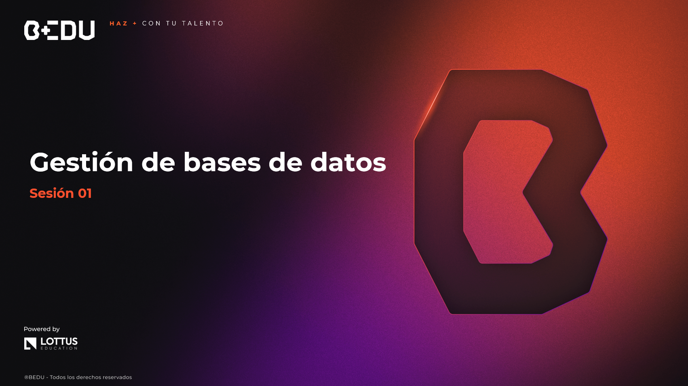

🏠 [**Inicio**](../Readme.md) ➡️ / 📖 `Sesión 01`

    

# 🎯 Objetivo

⚒️ Conocer las distintas interfaces que Java proporciona para interactuar con bases de datos, así como los fundamentos del uso de JPA y la creación de entidades para implementar operaciones CRUD.

---

📘 Material del prework:  
Antes de comenzar con los ejercicios de esta sesión, recordemos que en el material de prework hemos cubierto los fundamentos teóricos que aplicaremos hoy. A lo largo de esta sesión, pondremos en práctica estos conceptos mediante una serie de ejercicios y retos diseñados para reforzar y validar nuestro entendimiento. 
🔥¡Vamos a comenzar!🔥

---

## 📂 Temas de la sesión...

### 📖 Introducción a la conexión de bases de datos en Java  
Java permite conectarse con diversas bases de datos utilizando JDBC o mediante herramientas más modernas como JPA.

🔹 **Modelo de conexión en Java (JDBC)**  
🔹 **Ventajas del uso de ORM**  
🔹 **Conceptos de entidades, repositorios y persistencia**

📜 **[Ejemplo 01: JPA - Creación de entidades y repositorios](Ejemplo-01/Readme.md)**  
🔥 **[Reto 01: Registro de productos para inventario](Reto-01/Readme.md)**  

---

### 📖 Configuración de base de datos y entorno de desarrollo  
Para comenzar a trabajar con bases de datos en Java, se requiere configurar el entorno y definir las entidades que representarán las tablas.

🔹 **Configuración de conexión a base de datos embebida (H2)**  
🔹 **Uso de Maven y dependencias para JPA/Hibernate**  
🔹 **Configuración del archivo `application.properties`**

📜 **[Ejemplo 02: Configuración de conexión y creación de tablas](Ejemplo-02/Readme.md)**  
🔥 **[Reto 02: Modelo de relaciones para una tienda en línea](Reto-02/Readme.md)**  

---

### 📖 Conexión a una base de datos desde una aplicación web  
Integra una base de datos a una aplicación Java web usando JPA con Spring Boot para implementar operaciones CRUD.

🔹 **Integración de JPA con Spring Boot**  
🔹 **Controladores y servicios conectados a base de datos**  
🔹 **Pruebas básicas con endpoints y Postman**

📜 **[Ejemplo 03: Aplicación web con CRUD y JPA](Ejemplo-03/Readme.md)**  

---

⬅️ [**Anterior**](../Readme.md) | [**Siguiente**](../Sesion-02/Readme.md)➡️
