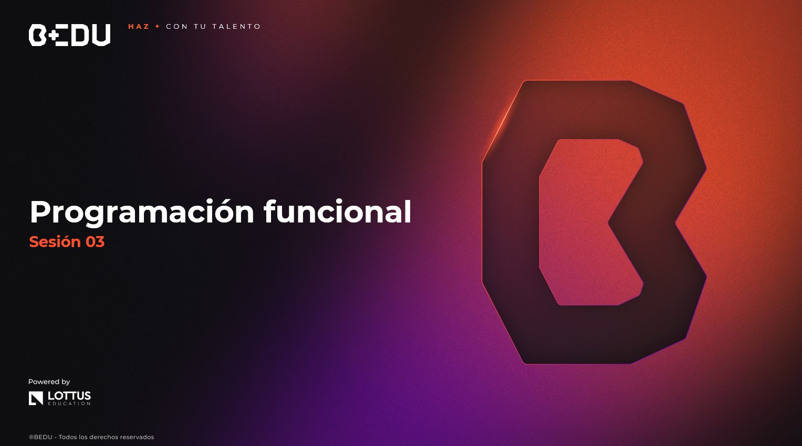

🏠 [**Inicio**](../../Readme.md) ➡️ / 📖 `Prework sesión 03`

<div align="center">
    
</div>

##### **PREWORK**
#### **🟧 Sesión 03**
#### **Programación funcional**


##### 🔶 **Introducción**

¡Hola! 👋 Prepárate para conocer una forma diferente (y muy útil) de programar en Java: la **programación funcional**.

¿Sabías que escribir menos código puede ser más eficiente y claro?  
En esta sesión descubrirás cómo **las funciones puras, las lambdas y los Streams** pueden ayudarte a escribir código más limpio, menos propenso a errores y mucho más expresivo.

Aunque al principio puede sonar raro, verás que aplicar este estilo **hace tu vida como desarrollador/a mucho más sencilla**. Aquí aprenderás a transformar listas, evitar nulls molestos, y encadenar operaciones como si fueran recetas de cocina.

---

#### 🎯 Objetivo

- Comprender los fundamentos del paradigma funcional y cómo aplicarlos en Java.
- Aprender a usar lambdas, referencias a métodos e interfaces funcionales.
- Conocer el uso de `Optional` para evitar errores por `null`.
- Aplicar la **Stream API** para transformar y procesar colecciones de manera fluida.
- Componer funciones y aplicar buenas prácticas en programación funcional.

---

#### 📋 Instrucciones

Este Prework está diseñado para conocer el contenido que se practicará durante la sesión en vivo. **Por favor no lo omitas.**

Toma notas de lo que consideres relevante y guarda tus preguntas o dudas para resolverlas en la sesión.

Antes de arrancar, verifica que tu entorno de desarrollo esté listo. Es fundamental que tengas instalado IntelliJ IDEA Community Edition y el JDK (Java Development Kit) para trabajar sin interrupciones.

Si te surge alguna dificultad con la instalación o cualquier duda, no dudes en pedir ayuda a tu experto/a. ¡Estamos aquí para asegurarnos de que todo fluya sin problemas! 🚀

---

**Bienvenido/a**

Bienvenid@ al tercer Prework del módulo. A continuación, te presentamos el tiempo estimado de lectura por tema, para que puedas revisar todos los recursos al máximo: 

| **📖 Temario**                                    | **🕰️ Tiempo sugerido** |
|----------------------------------------------------|------------------------|
| Tema 01. Fundamentos del paradigma funcional       | 10 min                 |
| Tema 02. Optional y Streams básicos                | 10 min                 |
| Tema 03. Composición funcional en Java             | 10 min                 |


**¡Comencemos! 🏁**

---
 
#### 📚 Tema 01. Fundamentos del paradigma funcional
##### ⏳ 10 minutos de lectura

La **programación funcional** es un estilo donde las funciones son tratadas como **ciudadanos de primera clase**: las puedes pasar como argumentos, devolverlas como resultado y combinarlas entre sí.

Su objetivo es que el código sea más **predecible y sencillo**, reduciendo estados mutables (que cambian constantemente) y evitando efectos secundarios.

**🧠 Conceptos clave**

| Concepto                | ¿Qué significa?                                                                |
|-------------------------|--------------------------------------------------------------------------------|
| **Función pura**        | Siempre devuelve el mismo resultado si recibe los mismos argumentos.           |
| **Estado inmutable**    | Una vez que un valor se asigna, **no cambia** (preferimos crear nuevas copias).|
| **Interfaz funcional**  | Una interfaz con un solo método abstracto (como `Predicate`, `Function`).      |


**🔥 Ejemplo de función pura**

```java
int sumar(int a, int b) {
    return a + b;
}
```
✔️ ¿Por qué es pura?
- Siempre que le pases, por ejemplo, `2` y `3`, te va a devolver 5.
- No depende de ninguna variable externa (solo usa lo que recibe como parámetros).
- No cambia nada afuera: no modifica archivos, bases de datos, variables globales, etc.

📌 Beneficios de las funciones puras:
- Son predecibles (nunca te dan sorpresas).
- Son fáciles de probar (con test unitarios).
- Son seguras en programas multihilo (no generan conflictos al no depender de variables compartidas).


**⚠️ Ejemplo de función impura**

```java
int contador = 0;

int incrementar() {
    return ++contador;
}
```
❌ ¿Por qué es impura?
- Depende de la variable externa `contador`.
- Cada vez que la llamas, el resultado cambia, incluso si no recibe parámetros.
- Además de devolver un valor, modifica `contador` (un efecto secundario).

**Entonces...**

|  Función pura                           |  Función impura                            |
|-------------------------------------------|-----------------------------------------------|
| 🎯 Solo depende de sus argumentos         | 🌐 Depende de variables externas o entorno.  |
| 🔒 No cambia nada fuera de sí misma       | ✍️ Puede modificar variables, archivos, etc. |
| 🔁 Predecible: siempre devuelve lo mismo  | 🎲 Impredecible: resultado puede cambiar     |
| 🧪 Fácil de probar y mantener             | 🐞 Más difícil de probar y depurar           |


**💡 Tip para detectar si una función es pura:**
1. ¿Recibe siempre los mismos parámetros?
2. ¿Devuelve siempre el mismo resultado con esos parámetros?
3. ¿No modifica nada afuera (ni variables, ni archivos, ni bases de datos)?

Si respondes sí a todas, ¡es pura!

**🔹 Lambdas y referencias a métodos**  
Las lambdas son funciones compactas que puedes pasar como argumento. Referencia a métodos permite pasar una función ya existente.  

🧪 Ejemplo con lambda

```java
List<String> nombres = Arrays.asList("Ana", "Luis", "Mario");
nombres.forEach(nombre -> System.out.println(nombre));
```

🧪 Ejemplo con referencia a método:

```java
nombres.forEach(System.out::println);
```

**🔹 Interfaces funcionales**
Java trae varias interfaces funcionales listas para usar:

| Interfaz        | ¿Qué hace?                              | Ejemplo de uso              |
|-----------------|-----------------------------------------|-----------------------------|
| `Predicate<T>`  | Evalúa una condición y devuelve boolean | `x -> x > 5`                |
| `Function<T,R>` | Transforma un valor T en un valor R     | `x -> x.toString()`         |
| `Consumer<T>`   | Ejecuta una acción sin devolver nada    | `x -> System.out.println(x)`|


¡Listo! Ahora ya sabes qué es eso de **funciones puras, estado inmutable y lambdas**.  
Empezaste a pensar diferente: en lugar de cambiar cosas, creas **nuevas versiones** de ellas. Eso hace que tu código sea **más seguro y fácil de entender.**

**💡 Tip:** Cuando escribas una función, pregúntate:  
*"¿Este código depende de algo externo? ¿Podría devolver siempre el mismo resultado?"*
Si la respuesta es sí, vas por buen camino hacia la programación funcional.

---

#### 📚 Tema 02. Optional y Streams básicos
##### ⏳ 10 minutos de lectura

Java es un lenguaje muy robusto, pero uno de sus errores más comunes (y temidos) es el famoso: `NullPointerException`

¿Te ha pasado que tu programa se cae por intentar acceder a algo que "no existe"?
Es como intentar abrir la puerta de un coche... que no está ahí.

Por eso, en esta sección aprenderás a:
- Evitar errores por `null` con `Optional`
- Procesar listas y colecciones de forma clara y fluida usando la **Stream API**

**🛡 ¿Por qué usar `Optional`?**
`Optional` es una clase que te obliga a pensar en los valores nulos antes de que ocurra el error.
En lugar de recibir directamente un valor que puede ser `null`, lo envuelves en un "contenedor seguro" que te obliga a manejarlo bien.

🧪 Ejemplo clásico con posible error

```java
String nombre = obtenerNombre(); // puede ser null
System.out.println(nombre.toUpperCase()); // ¡boom! NullPointerException
```

✅ Con `Optional`:

```java
Optional<String> nombre = Optional.ofNullable(obtenerNombre());
nombre.ifPresent(n -> System.out.println(n.toUpperCase()));
```
**🧠 Traducción:** “Si hay un valor, úsalo. Si no, ignóralo con elegancia.”


💡 Métodos útiles de `Optional`

| Método        | ¿Qué hace?                                      |
|---------------|-------------------------------------------------|
| `of()`        | Crea un Optional a partir de un valor no nulo   |
| `ofNullable()`| Crea un Optional que puede ser null             |
| `isPresent()` | Verifica si hay valor                           |
| `ifPresent()` | Ejecuta una acción si el valor existe           |
| `orElse()`    | Devuelve un valor por defecto si está vacío     |
| `map()`       | Aplica una función al valor (si existe)         |


**🌊 ¿Qué es un Stream y por qué usarlo?**

Un **Stream** en Java es una secuencia de elementos que se puede procesar como si fluyera, de forma parecida a una cinta transportadora:

puedes filtrar, transformar, ordenar y recolectar los datos sin escribir bucles ni estructuras complejas.

🧪 Ejemplo tradicional

```java
List<String> nombres = Arrays.asList("Ana", "Luis", "Mario");

for (String nombre : nombres) {
    if (nombre.length() > 3) {
        System.out.println(nombre.toUpperCase());
    }
}
```

✅ Con `Stream`

```java
nombres.stream()
       .filter(nombre -> nombre.length() > 3)
       .map(String::toUpperCase)
       .forEach(System.out::println);
```
🔍 ¿Qué hicimos?

1. 🎣 `filter` – Filtra los nombres con más de 3 letras
2. 🛠 `map` – Convierte esos nombres a mayúsculas
3. 📢 `forEach` – Los imprime uno por uno

🎯 Mismo resultado, menos líneas, más claro y flexible.

**🔚 Operaciones en Streams**

| Tipo de operación            | Ejemplos                                  |
|------------------------------|-------------------------------------------|
| Intermedia (encadenables)    | `map`, `filter`, `sorted`, `limit`        |
| Terminal (finaliza el flujo) | `forEach`, `collect`, `count`, `anyMatch` |

> **🧠 Regla de oro**: Un Stream solo puede ejecutarse una vez.

Ya viste cómo prevenir errores por valores nulos usando `Optional`, y cómo los Streams te ayudan a procesar listas de manera más elegante, clara y funcional.
No solo ahorras líneas de código, sino que mejoras la legibilidad y reduces errores.

**💡 Tip final:** Si estás revisando muchos `null` o escribiendo varios for seguidos, ¡detente! Seguramente puedes usar `Optional` o un `Stream`.

¡Menos código, más claridad!


---

#### 📚 Tema 03. Composición funcional en Java
##### ⏳ 10 minutos de lectura

La **composición funcional** es cuando combinas funciones pequeñas para crear procesos más complejos, encadenando operaciones.

**🔗 Encadenamiento de funciones**

```java
Function<Integer, Integer> multiplicarPor2 = x -> x * 2;
Function<Integer, Integer> sumar3 = x -> x + 3;

Function<Integer, Integer> combinado = multiplicarPor2.andThen(sumar3);

System.out.println(combinado.apply(5)); // Resultado: 13
```
**💡 Tip**: `andThen()` aplica las funciones en orden, mientras que `compose()` las aplica al revés.


Aquí diste el siguiente nivel: componer funciones para crear procesos más complejos y usar `flatMap` para transformar estructuras como un pro.
Entendiste cómo encadenar funciones pequeñas para lograr resultados grandes.

💡 Tip: Cuando veas que tu código hace pasos secuenciales, piensa si puedes convertir esas acciones en funciones independientes y encadenarlas.
¡Te hará más fácil entenderlo y reutilizarlo!


---

#### 🧠 Actividad de reforzamiento
**Actividad 1.** Relaciona columnas

| Concepto              | Función principal                                       |
|-----------------------|---------------------------------------------------------|
| A) `wait()`           | (___) Retorna el resultado de una tarea asíncrona       |
| B) `ExecutorService`  | (___) Hace que un hilo espere hasta ser notificado      |
| C) `Callable`         | (___) Clase que representa un hilo estándar             |
| D) `Thread`           | (___) Similar a Runnable, pero puede devolver un valor  |
| E) `Future`           | (___) Administra un conjunto de hilos y tareas          |

**Actividad 2.** Mini reto: magina que estás construyendo un programa que guarda pedidos mientras se procesan en paralelo.


**Preguntas:**

¿Qué estructuras y mecanismos usarías para:

- Ejecutar múltiples tareas que procesan los pedidos?

- Garantizar que no se procesen dos veces los mismos datos?

- Recoger los resultados una vez que cada tarea termine?

---

#### **📝 Cierre**

Ahora ya sabes cómo hacer que tus programas respiren multitarea sin explotar 💥  
Con los hilos y la concurrencia, puedes lograr que tu app haga varias cosas a la vez de forma más eficiente y profesional.  
Has conocido tanto la forma clásica (`Thread`, `Runnable`) como las modernas (`ExecutorService`, `Future`, `Locks`) para construir soluciones robustas.  

¡Prepárate para ponerlo en práctica y descubrir el verdadero poder del paralelismo! ⚙️🔥  

---

⬅️ [**Anterior**](../../Sesion-02/Prework/Readme.md) | [**Siguiente**](../../Sesion-04/Prework/Readme.md)➡️  