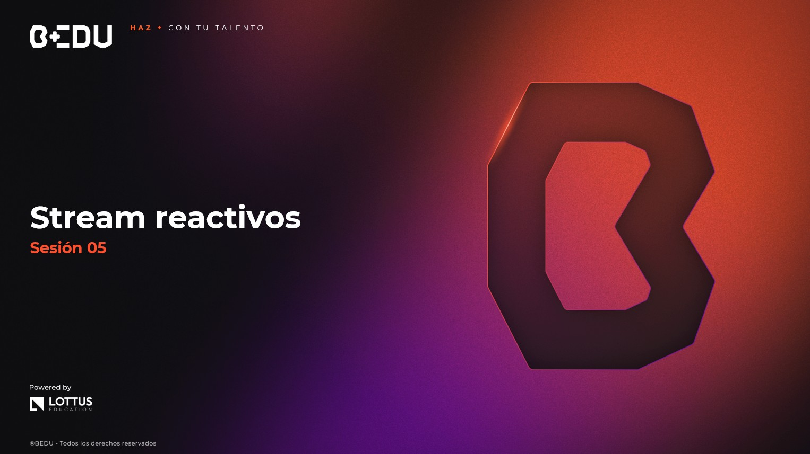

 🏠 [**Inicio**](../Readme.md) ➡️ / 📖 `Sesión 05`

    

# 🎯 Objetivo

⚒️ Comprender los fundamentos de la **programación reactiva** en Java, conocer las diferencias con el manejo tradicional de streams, e implementar flujos reactivos utilizando **Project Reactor** o **RxJava**, abordando conceptos clave como **Mono**, **Flux** y **control de backpressure**.

---

 📘 Material del prework:  
Antes de comenzar con los ejercicios de esta sesión, recordemos que en el material de prework hemos cubierto los fundamentos teóricos de la **programación reactiva**, los cuales aplicaremos hoy mediante una serie de ejercicios prácticos diseñados para fortalecer nuestro entendimiento.  
🔥¡Vamos a comenzar!🔥

---

## 📂 Temas de la sesión...

### 📖 Introducción a programación reactiva  
Exploraremos qué es la programación reactiva, cuándo conviene usarla, y cómo se diferencia del **Stream API tradicional**.

 🔹 **¿Qué es y por qué usarla?**  
 🔹 **Diferencia con Stream API tradicional**  
 🔹 **Patrones reactivos comunes**

 📜 **[Ejemplo 01: Comparativa entre Stream API y programación reactiva](Ejemplo-01/Readme.md)**  

---

### 📖 Project Reactor / RxJava  
Implementaremos flujos reactivos usando **Project Reactor** o **RxJava**, aprendiendo los conceptos clave y operadores básicos.

 🔹 **Conceptos clave: Mono, Flux**  
 🔹 **Operadores: map, flatMap, filter**  
 🔹 **Subscripción y ejecución**

 📜 **[Ejemplo 02: Flujo reactivo básico con Flux y Mono](Ejemplo-02/Readme.md)**  
 🔥 **[Reto 01: Gestión reactiva de sistemas críticos en Meridian Prime](Reto-01/Readme.md)**  

---

### 📖 Manejo avanzado de flujos  
Abordaremos técnicas para el **manejo de backpressure**, el encadenamiento de operaciones, y casos comunes de uso en sistemas modernos.

 🔹 **Control de backpressure**  
 🔹 **Encadenamiento de operaciones**  
 🔹 **Casos de uso comunes (servicios, flujos de eventos)**

 📜 **[Ejemplo 03: Control de backpressure en flujos reactivos](Ejemplo-03/Readme.md)**  
 🔥 **[Reto 02: Procesamiento de eventos en una cadena de producción reactiva](Reto-02/Readme.md)**  

---

⬅️ [**Anterior**](../Sesion-04/Readme.md) | [**Siguiente**](../Sesion-06/Ejemplo-01/Readme.md)➡️  