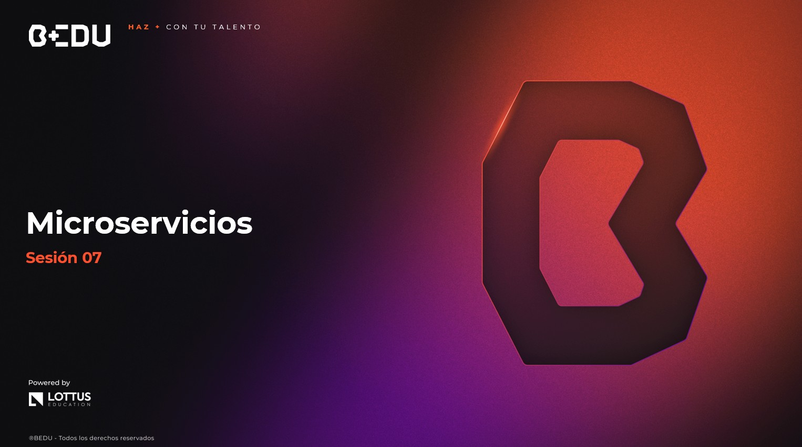

🏠 [**Inicio**](../../Readme.md) ➡️ / 📖 `Prework sesión 07`

<div align="center">
    
</div>

##### **PREWORK**
#### **🟧 Sesión 07**
#### **Microservicios**


##### 🔶 **Introducción**

En muchos equipos de desarrollo, el tamaño de la aplicación no siempre es el problema… hasta que algo tan simple como ajustar una funcionalidad menor termina retrasando el despliegue completo del sistema.

Cambiar una línea en el cálculo de impuestos o modificar un mensaje de error puede convertirse en una operación de alto riesgo, donde todo debe ser probado y desplegado de nuevo.

Este tipo de situaciones suele aparecer en arquitecturas monolíticas, donde cada componente está estrechamente ligado al resto. Todo se mueve como un solo bloque: sólido, pero difícil de maniobrar.

Frente a estos retos, muchas empresas han optado por una solución diferente: dividir la aplicación en servicios más pequeños, cada uno autónomo, especializado en una tarea, pero colaborando entre sí. Así nace la **arquitectura de microservicios**.

Hoy exploraremos cómo funcionan estos sistemas distribuidos, sus ventajas y desventajas, y cómo comenzar a construir tu propio microservicio usando Spring Boot, una de las herramientas más utilizadas en el ecosistema Java.

Prepárate para descubrir una forma modular y flexible de desarrollar software que se adapta mejor a los cambios y crece contigo. 🚀

---

#### 🎯 Objetivo

- Comprender qué es la arquitectura de microservicios y sus diferencias con los monolitos.
- Identificar ventajas, desventajas y casos de uso reales.
- Crear una API REST básica con Spring Boot.
- Comprender cómo los microservicios se comunican entre sí.
- Explorar herramientas de prueba como Postman o Swagger.

---

#### 📋 Instrucciones

Este Prework está diseñado para conocer el contenido que se practicará durante la sesión en vivo. **Por favor no lo omitas.**

Toma notas de lo que consideres relevante y guarda tus preguntas o dudas para resolverlas en la sesión.

Antes de arrancar, verifica que tu entorno de desarrollo esté listo. Es fundamental que tengas instalado IntelliJ IDEA Community Edition y el JDK (Java Development Kit) para trabajar sin interrupciones.

Si te surge alguna dificultad con la instalación o cualquier duda, no dudes en pedir ayuda a tu experto/a. ¡Estamos aquí para asegurarnos de que todo fluya sin problemas! 🚀

---

**Bienvenido/a**

Bienvenid@ al septimo Prework del módulo. A continuación, te presentamos el tiempo estimado de lectura por tema, para que puedas revisar todos los recursos al máximo: 

| **📖 Temario**                           | **🕰️ Tiempo sugerido** |
|------------------------------------------|------------------------|
| Tema 01. Arquitectura de microservicios  | 10 min                 |
| Tema 02. Introducción a Spring Boot      | 10 min                 |
| Tema 03. Comunicación entre servicios    | 10 min                 |


**¡Comencemos! 🏁**

---
 
#### 📚 Tema 01. Arquitectura de microserviciosa
##### ⏳ 10 minutos de lectura

**📌 ¿Qué es un microservicio?**

Un microservicio es una unidad independiente de una aplicación que se encarga de una función específica.
Cada microservicio tiene su propia lógica, base de datos (opcional), y se comunica con otros microservicios a través de redes (por ejemplo, usando HTTP/REST).

Lo importante es que cada microservicio vive por su cuenta, como una tienda en un centro comercial:
- Cada tienda tiene su propio personal, sus productos y sus horarios.
- Pero todas están dentro de un mismo centro, trabajando coordinadamente para que los clientes tengan una buena experiencia general.

**🧩 ¿Cómo funciona un microservicio en la práctica?**

Pensemos en una tienda en línea:


| Funcionalidad	| Enfoque Monolítico	| Enfoque Microservicios |
|------------------------------------------|------------------------|--------|
| Carrito de compras	| Parte del mismo sistema centralizado	| Es un servicio separado que gestiona los carritos |
| Módulo de pagos	| Integrado en el código base	| Es un servicio independiente que procesa pagos |
|  Inventario	| Compartido con el resto del sistema	| Tiene su propio servicio y base de datos |

🛡️ Con microservicios, cada módulo puede actualizarse o escalarse por separado. Si el módulo de pagos necesita manejar más tráfico (por ejemplo, en el Buen Fin), puedes escalarlo sin tocar los demás servicios.

**🤜🤛 Diferencias con la arquitectura monolítica**

| Aspecto	| Monolito	| Microservicios |
|------------------------------------------|------------------------|--------|
| Despliegue	| Se despliega toda la aplicación junta	| Se despliegan los servicios que cambian |
| Escalabilidad	| Escalas todo el sistema completo	| Escalas solo el servicio que lo necesita |
| Flexibilidad tecnológica	| Una sola tecnología para todo	| Puedes usar tecnologías distintas en cada servicio |
| Dependencias internas	| Fuertemente acoplado (todo está conectado)	| Débilmente acoplado (los servicios se conectan por red) |
| Impacto de fallas	| Una falla afecta todo el sistema	| Una falla solo afecta al servicio específico |

💡 Ejemplo 

En un monolito, si actualizas la lógica del carrito de compras, debes revisar toda la aplicación, aunque no afecte directamente a pagos o inventario.
En microservicios, actualizas solo el servicio del carrito, sin preocuparte por los demás.

**🟢 Ventajas**

- Despliegue independiente: Puedes actualizar solo lo que necesitas, sin afectar a todo el sistema. 

- Escalabilidad granular: Si un servicio (por ejemplo, pagos) tiene alta demanda, puedes escalarlo solo a él. 

- Mejor tolerancia a fallos: Si un servicio falla (por ejemplo, recomendaciones), el resto sigue funcionando.

- Flexibilidad tecnológica: Puedes usar Java para un servicio, Python para otro, y Node.js en otro más (si tiene sentido para el equipo).

**🔴 Desventajas**

- Complejidad en la comunicación: Los microservicios se comunican por red. Esto introduce latencia y posibles fallos de conexión.

- Mayor carga operativa: Ahora tienes que monitorear, desplegar y mantener muchos servicios en lugar de uno solo.

- Sincronización de datos: Si cada servicio tiene su base de datos, mantener consistencia entre ellas puede ser desafiante.

**🧠 Casos reales de uso**

1. Netflix
Opera con miles de microservicios para procesar contenido personalizado, autenticación, recomendaciones, etc.
    - Cada microservicio puede escalar de forma independiente según la carga (ej. en horarios pico).

2. Amazon
Separó su tienda online en decenas de microservicios para manejar pagos, inventario, pedidos, recomendaciones, etc.
    - Esto les permite innovar en una parte del sistema sin tener que tocar el resto.

3. Spotify
Maneja microservicios para catálogo de música, listas de reproducción, publicidad, y recomendaciones personalizadas.


Estos casos muestran que a **mayor crecimiento, más necesidad de modularidad y escalabilidad**. 


**🎨 Visualización**

Puedes pensar los microservicios como algo asi:

```plaintext

       [Frontend]
            ↓
 ┌──────────┬──────────┬──────────┐
 │ Inventario │ Carrito │ Pagos   │ (Microservicios)
 └──────────┴──────────┴──────────┘
 Cada microservicio tiene su propia lógica y comunica por red.
 ```

**Resumen...**

Adoptar microservicios es como dividir un problema grande en piezas pequeñas, donde cada una se maneja por separado. 

Esto te da agilidad, escala y resiliencia ante fallos. Pero también exige organización, automatización y monitoreo adecuado.

**🔥 Tip final** 
No todos los sistemas necesitan microservicios desde el principio, pero si trabajas en un proyecto que crece rápidamente, o tiene módulos que deben evolucionar a ritmos distintos, considera modularizar poco a poco en microservicios para mantener la agilidad del desarrollo.


---

#### 📚 Tema 02. Introducción a Spring Boot
##### ⏳ 10 minutos de lectura

**📌 ¿Qué es Spring Boot?**
Spring Boot es un framework que forma parte del ecosistema de Spring, la plataforma Java más utilizada para crear aplicaciones empresariales.

Spring Framework ya ofrecía muchas herramientas para manejar seguridad, bases de datos, transacciones, etc.

Pero... tenía un gran inconveniente:

**👉 Configurar Spring tradicionalmente era complejo y repetitivo.**

Cada vez que arrancabas un proyecto, tenías que:

- 💥 Configurar el servidor de aplicaciones (Tomcat, Jetty).
- 😖 Definir manualmente los beans y dependencias.
- 😵‍💫Establecer configuraciones para bases de datos, seguridad, JSON, etc.

Spring Boot nace como respuesta a esto, ofreciendo un arranque rápido, con:

- 🤓 Configuración automática de componentes.
- 🧠Dependencias preconfiguradas (starters).
- 💻 Servidor embebido listo para funcionar.

🏆 Resultado
Con Spring Boot, puedes levantar un servicio REST en minutos, sin preocuparte por detalles técnicos complejos al inicio.

**🧐 ¿Qué resuelve Spring Boot?**

| Problema común en proyectos Java tradicionales | ¿Cómo lo resuelve Spring Boot?
|--------------------------------------------------|-----------------|
| Configurar manualmente servidor (Tomcat, Jetty) | Servidor embebido incluido (puedes elegir entre Tomcat, Jetty, etc.)|
| Mucha configuración XML | Usa anotaciones y configuración automática
| Integrar bases de datos o JSON requiere esfuerzo | Usa starters (dependencias preconfiguradas para DBs, web, seguridad)|
| Arranque lento y costoso | Arranque rápido, ideal para prototipos o microservicios|

**🧪 ¿Por qué es útil para microservicios?**

Los microservicios requieren iniciar y desplegar pequeños servicios de forma independiente. Con Spring tradicional, cada microservicio sería pesado de configurar y arrancar.

Con Spring Boot:
- Cada microservicio es independiente, ligero y fácil de arrancar.
- Puedes tener un servicio de pagos en puerto 8081, otro de carrito en 8082, sin preocuparte por instalar Tomcat o configurar beans manualmente.
- Escalas y despliegas cada servicio sin tocar el resto.

💬 Piensalo asi:

Es como tener pequeños food trucks en lugar de un gran restaurante:
- Cada uno vende algo diferente,
- Tiene su propio ritmo,
- Se adapta al lugar donde esté.

**🤜🤛 Comparación con otras tecnologías (para microservicios)**

| Tecnología	    | Tipo de lenguaje	| ¿Cómo ayuda a crear microservicios?                                       |
|-------------------|-------------------|---------------------------------------------------------------------------|
| Spring Boot	    | Java	            | Configuración automática, servidor embebido, ideal para APIs REST en Java.|
| Node.js (Express)	| JavaScript	    | Ligero, ideal para microservicios rápidos en JS.                          |
| Flask	            | Python	        | Simple para APIs pequeñas en Python.                                      |
| Django	        | Python	        | Más robusto, pero puede ser pesado para microservicios.                   |

💥 Diferencia clave
Spring Boot es la opción ideal para Java, especialmente si vienes del mundo empresarial o necesitas robustez.

**🏗️ Estructura típica de un proyecto Spring Boot**

```plaintext

src/
 └── main/
      ├── java/
      │    └── com/miproyecto/
      │          ├── MiProyectoApplication.java (Punto de entrada)
      │          ├── controller/ (Controladores HTTP)
      │          │    └── SaludoController.java
      │          ├── service/ (Lógica de negocio)
      │          │    └── SaludoService.java
      │          └── model/ (Modelos de datos)
      │               └── Usuario.java
      └── resources/
           └── application.properties (Configuración: puerto, DB, etc.)
```

**🔧 ¿Qué son los starters de Spring Boot?**
Los starters son paquetes preconfigurados que incluyen las dependencias necesarias para una funcionalidad específica.

Ejemplos:

- **spring-boot-starter-web** → Para crear APIs REST.

- **spring-boot-starter-data-jpa** → Para conectar a bases de datos usando JPA.

- **spring-boot-starter-security** → Para gestionar seguridad.

💫 Beneficio: No tienes que buscar y configurar todas las librerías manualmente.

**🧪 Ejemplo: Crear una API REST sencilla**

1. Dependencia principal en Maven (`pom.xml`):

```xml
<dependency>
    <groupId>org.springframework.boot</groupId>
    <artifactId>spring-boot-starter-web</artifactId>
</dependency>
```

2. Clase principal:

```java
@SpringBootApplication
public class MiProyectoApplication {
    public static void main(String[] args) {
        SpringApplication.run(MiProyectoApplication.class, args);
    }
}
```

3. Controlador básico

```java
@RestController
@RequestMapping("/saludo")
public class SaludoController {

    @GetMapping
    public String saludar() {
        return "¡Hola desde Spring Boot!";
    }
}
```

4. Probar en navegador o Postman:
Accede a `http://localhost:8080/saludo` y obtendrás:
**"¡Hola desde Spring Boot!"**

**Resumen...**

Spring Boot te permite levantar servicios web funcionales en minutos, con mínimo esfuerzo de configuración.
Es ideal para microservicios porque cada uno puede ser independiente, ligero y fácilmente desplegable.

**🔥 Tip final** 
Si necesitas probar una idea, crear una API interna, o levantar un microservicio rápido para tu empresa, Spring Boot acelera el proceso y reduce la fricción técnica, permitiéndote enfocarte en la lógica de negocio, no en las configuraciones.

---

#### 📚 Tema 03.  Comunicación entre servicios
##### ⏳ 10 minutos de lectura

En una arquitectura de microservicios, cada servicio funciona de manera independiente, pero colabora con otros para lograr el objetivo del sistema completo.
La comunicación entre servicios es lo que permite que, por ejemplo:

- El servicio de pagos valide una compra con el servicio de inventario.
- El servicio de usuarios consulte información al servicio de notificaciones para enviar un correo.

💬 Visualizalo asi
Piensa en un equipo de fútbol. Cada jugador tiene su rol independiente (portero, defensa, delantero), pero se comunican constantemente para coordinar jugadas. Sin comunicación, el equipo no funciona.

**🔗 Formas de comunicación entre microservicios**

Existen dos formas principales de comunicación:

| Tipo | ¿Cómo funciona? | Ejemplo práctico |
|-----------------|-----------------------------------------------------------|------------------------------------------------------------------|
| Síncrona (REST) | Un servicio llama directamente a otro (espera respuesta). | Servicio de carrito hace una petición HTTP al servicio de pagos. |
| Asíncrona (Mensajería) | Los servicios se comunican a través de mensajes (no esperan respuesta inmediata). | Servicio de órdenes envía un mensaje a una cola (ej. RabbitMQ) y el servicio de inventario lo procesa cuando puede. |

**🧩 Comunicación síncrona con REST**
La comunicación síncrona es la más directa:
- Un servicio hace una solicitud HTTP (GET, POST, etc.) a otro servicio.
- Espera la respuesta inmediata.

✅ **Ventaja**: Simple de implementar (usa HTTP/REST, como una API normal).

🚫 **Desventaja**: Si uno de los servicios falla o tarda, el otro se queda esperando.

**🧪 Ejemplo con Spring Boot: REST entre servicios**

Supongamos que tienes:

- **Servicio A (Carrito)** en **localhost:8080**
- **Servicio B (Pagos)** en **localhost:8081**

Desde **Servicio A**, llamas al **Servicio B** usando `RestTemplate`:

```java
@RestController
@RequestMapping("/carrito")
public class CarritoController {

    private final RestTemplate restTemplate = new RestTemplate();

    @GetMapping("/validar-pago")
    public String validarPago() {
        String urlPago = "http://localhost:8081/pagos/validar";
        String respuestaPago = restTemplate.getForObject(urlPago, String.class);
        return "Resultado del pago: " + respuestaPago;
    }
}
```

🌟 Aquí, Servicio A hace una llamada HTTP GET al Servicio B.

🔥 Tip profesional
En aplicaciones grandes, es recomendable usar Feign Client o WebClient (más modernos y no bloqueantes) en lugar de RestTemplate.

**🧩 Comunicación asíncrona con mensajería**
La comunicación asíncrona se hace a través de mensajes en una cola (ej. RabbitMQ, Kafka):
- Un servicio envía un mensaje a la cola.
- Otro servicio procesa ese mensaje cuando esté listo.

🟢 Ventaja: 
- No necesitas que ambos servicios estén disponibles al mismo tiempo.
- Escalable y tolerante a fallos.

🔴 Desventaja:
- Más compleja de configurar (necesitas un broker de mensajes como RabbitMQ).

**🧪 Ejemplo conceptual con mensajería**
```plaintext
[Servicio de pedidos] → Envía mensaje → [Cola de RabbitMQ] → [Servicio de inventario]
```

- El servicio de pedidos notifica que hay una nueva orden.
- El servicio de inventario procesa esa orden cuando puede.

⚡ Uso común: 
Para eventos que no necesitan respuesta inmediata (envío de correos, actualizaciones de inventario, logs, etc.).

🎨 Visualización de los dos enfoques:
```plaintext

Síncrono (REST):
  Servicio A ────────► Servicio B
       espera respuesta

Asíncrono (Mensajería):
  Servicio A ────────► Cola de mensajes ────────► Servicio B
       no espera respuesta inmediata
```

**🧠 ¿Cuándo usar cada tipo?**

| Situación | ¿Qué tipo usar? | ¿Por qué? |
|-----------|-----------------|-----------|
| Validar pagos, verificar stock | Síncrono (REST) | Necesitas respuesta inmediata para continuar. |
| Enviar correos, registrar logs | Asíncrono (Mensajería) | No necesitas respuesta inmediata, solo que ocurra.

**🚀 Tip para microservicios grandes**

- Usa REST para consultas rápidas o cuando necesites la respuesta al instante.
- Usa mensajería cuando puedas desacoplar procesos (por ejemplo, enviar una notificación sin bloquear la operación principal).

**Resumen...**

La comunicación entre microservicios es la clave para que el sistema funcione como un todo.
- Si necesitas respuesta inmediata, usa REST (síncrono).
- Si puedes desacoplar la operación, usa mensajería (asíncrono).

**🔥 Tip final**
En proyectos con múltiples microservicios, empieza con REST para comunicaciones críticas (como pagos), pero considera mensajería para eventos secundarios (como logs, notificaciones, auditorías) para mejorar la resiliencia y escalabilidad.

---

#### 🧠 Actividad de reforzamiento

**🎯 Objetivo**
- Analizar y diseñar cómo implementarías la comunicación entre microservicios según las necesidades de cada módulo.
- Evaluar qué tipo de comunicación utilizarías (síncrona/asíncrona) y cómo estructurarías los servicios.

**🧩 Instrucciones**
1. Se te presentan dos escenarios reales.
2. Para cada uno:
    - Identifica qué tipo de comunicación es la más adecuada (síncrona o asíncrona).
    - Describe cómo estructurarías los microservicios involucrados usando Spring Boot.
    - Menciona qué herramienta o protocolo utilizarías (REST, RabbitMQ, Kafka, etc.).
3. Reflexiona por qué tomaste esas decisiones.

**🎭 Escenario 1: Plataforma de cursos en línea**
Tu sistema tiene los siguientes módulos:
 
- Gestión de usuarios: Maneja el registro, autenticación y datos personales.
- Gestión de cursos: Administra los cursos disponibles.
- Notificaciones: Envía correos cuando un usuario se inscribe a un curso.

Preguntas:
- ¿Cómo se comunicarían los servicios de usuarios y cursos?
- ¿Qué tipo de comunicación utilizarías entre gestión de cursos y notificaciones?
- ¿Cómo garantizarías que las notificaciones se envíen sin bloquear la inscripción?

**🎭 Escenario 2: Tienda en línea en temporada alta**
Los módulos son:

- Carrito de compras: Maneja los productos agregados por el usuario.
- Servicio de pagos: Procesa las transacciones.
- Inventario: Actualiza las existencias después de una compra.
- Registro de eventos: Guarda logs de transacciones.

Preguntas:
- ¿Qué tipo de comunicación usarías entre carrito de compras y servicio de pagos?
- ¿Cómo comunicarías el servicio de pagos con el inventario para actualizar existencias?
- ¿Qué estrategia aplicarías para registrar eventos de compra sin afectar el rendimiento general?

**💡 Sugerencia**
Recuerda que la comunicación síncrona (REST) es mejor cuando necesitas una respuesta inmediata (como validar un pago), y la asíncrona (mensajería) es ideal para eventos que pueden procesarse en segundo plano (como enviar correos o registrar logs).

---

#### **📝 Cierre**

Hoy diste un paso importante en la comprensión de cómo dividir sistemas grandes en piezas más manejables y adaptables.
Aprendiste que la arquitectura de microservicios no solo es una moda, sino una respuesta técnica a los retos de crecimiento, escalabilidad y resiliencia que enfrentan muchas aplicaciones modernas.

Exploraste cómo Spring Boot facilita la creación de servicios independientes, permitiéndote arrancar rápido sin perder robustez, y cómo los servicios se comunican entre sí usando:

- REST para respuestas inmediatas entre microservicios,
- Mensajería asíncrona para procesos desacoplados y escalables.

**🔥 Tip final**
Cuando enfrentes un proyecto que crece rápido o tenga múltiples módulos críticos (pagos, usuarios, inventario), evalúa si la arquitectura de microservicios es adecuada para mantener la flexibilidad y el control sobre cada parte.

Y si decides implementarlos, Spring Boot puede ser tu mejor aliado para iniciar microservicios de forma ágil, pero no olvides planificar cómo se comunicarán para que el sistema fluya de forma coherente y confiable.

Los microservicios son como un equipo bien coordinado: cada uno hace su parte, pero el éxito depende de cómo se comunican y colaboran. 🚀

