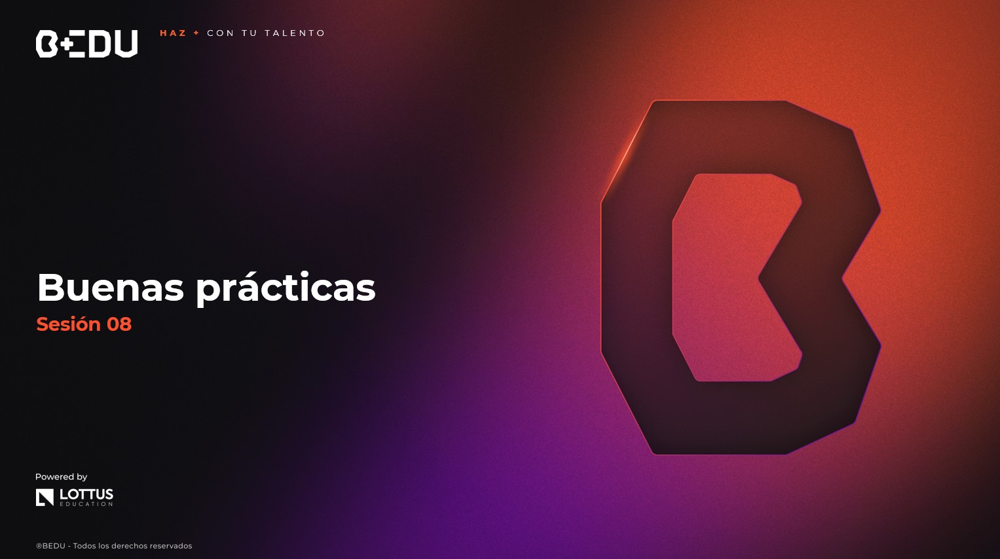

🏠 [**Inicio**](../Readme.md) ➡️ / 📖 `Sesión 08`

    

# 🎯 Objetivo

⚒️ Adoptar **buenas prácticas de diseño en Java**, reforzar conceptos de **pruebas unitarias**, **depuración** y conocer las **herramientas esenciales** para mantener proyectos limpios y colaborativos (control de versiones, documentación, logs).

---

📘 Material del prework:  
Revisamos conceptos clave sobre **principios SOLID**, **refactorización básica**, y el uso de **Git** y **pruebas unitarias**. Hoy vamos a practicar con ejemplos concretos.

🔥 ¡Vamos a comenzar! 🔥

---

## 📂 Temas de la sesión...

### 📖 Principios de diseño en Java

🔹 Convenciones de código  
🔹 Refactorización básica  
🔹 Introducción a patrones de diseño (GoF)

📜 **[Ejemplo 01: Aplicación de principios SOLID](Ejemplo-01/Readme.md)**  
🔥 **[Reto 01: Refactorizar un procesador de pagos aplicando SOLID](Reto-01/Readme.md)**  

---

### 📖 Pruebas unitarias y depuración

🔹 JUnit 5 y aserciones básicas  
🔹 Mocks y pruebas con Mockito  
🔹 Logs con SLF4J

📜 **[Ejemplo 02: Pruebas unitarias con JUnit](Ejemplo-02/Readme.md)**  
🔥 **[Reto 02: Simulación de pruebas unitarias en un microservicio](Reto-02/Readme.md)**  

---

### 📖 Organización del código y control de versiones

🔹 Estructura por capas y paquetes  
🔹 Buen uso de Git y GitHub  
🔹 Comentarios útiles y documentación mínima

📜 **[Ejemplo 03: Organización de proyecto y control de versiones](Ejemplo-03/Readme.md)**  

---

⬅️ [**Anterior**](../Sesion-07/Readme.md) | [**Siguiente**](../Readme.md)➡️  