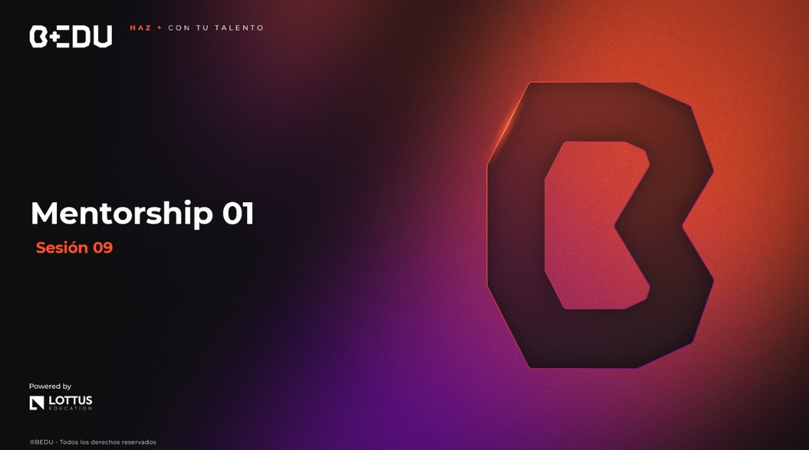

🏠 [**Inicio**](../../Readme.md) ➡️ / 📖 `Prework sesión 09`

<div align="center">
    
</div>

##### **PREWORK**
#### **🟧 Sesión 09**
#### **Mentorship 1**

##### 🔶 **Introducción** 

¡Hola! 👋

Estamos por llegar a la sesión final de este módulo de **Java Standard Edition II**, lo que significa que has recorrido un camino lleno de nuevos conceptos, desafíos y aprendizajes. 🎉

Has pasado por temas avanzados como **concurrencia, programación funcional, bases de datos, buenas prácticas de diseño y pruebas unitarias**, herramientas esenciales para cualquier desarrollador Java en el mundo profesional.

Este último paso es especial: vas a integrar todo lo aprendido en un proyecto completo, similar a los sistemas que podrías desarrollar en una empresa real. Hoy te prepararás para construir un **microservicio robusto para la gestión de préstamos personales**, aplicando todos estos conceptos en conjunto.

¡Estás cada vez más cerca de tu meta de ser un desarrollador Java profesional! 🚀

---

#### 🎯 Objetivo  

- Comprender los principios y fundamentos necesarios para desarrollar un microservicio de préstamos personales, aplicando temas avanzados como bases de datos (H2 + JPA), concurrencia (CompletableFuture), programación funcional, logs en contexto (SLF4J) y pruebas unitarias con JUnit + Mockito.

---

#### 📋 Instrucciones

Este Prework está diseñado para conocer el contenido que se practicará durante la sesión en vivo. **Por favor no lo omitas**. Toma notas de lo que consideres relevante y guarda tus preguntas o dudas para resolverlas en la sesión.

---

#### Bienvenido/a

Bienvenid@ al noveno Prework del módulo. A continuación, te presentamos el tiempo estimado de lectura por tema, para que puedas revisar todos los recursos al máximo:

| **📖 Temario**                                      | **🕰️ Tiempo sugerido** |
|-----------------------------------------------------|-------------------------|
| Tema 01. Teoría y fundamentos para caso de estudio  | 15 min                  |

**¡Comencemos! 🏁**

---
 
#### 📚 Tema 01. Teoría y fundamentos para caso de estudio
##### ⏳ 15 minutos de lectura

Hoy daremos un paso decisivo: dejamos atrás los ejemplos aislados y las prácticas individuales para construir algo más ambicioso y alineado con los desafíos del mundo profesional.

Vas a desarrollar un caso de estudio, es decir, una aplicación funcional que simula un escenario real de la industria financiera. En este caso, construiremos un **microservicio robusto para la gestión de préstamos personales**, como los que operan en las fintech para evaluar solicitudes, registrar préstamos y procesar pagos de forma integral.

Este proyecto te permitirá integrar gran parte de los conceptos avanzados que has aprendido:

- Persistencia de datos con JPA y H2
- Concurrencia con `CompletableFuture` para evaluaciones asíncronas
- Programación funcional con Streams para filtrar y procesar información
- Registro de logs en contexto con SLF4J
- Pruebas unitarias con JUnit 5 y Mockito

El objetivo no es solo que el sistema funcione, sino que pienses como software developer, entendiendo cómo estructurar soluciones sólidas, cómo manejar procesos concurrentes y cómo escalar tu aplicación.

Prepárate para conectar todos los temas del módulo y dar un paso firme hacia el desarrollo de sistemas reales y robustos. 🚀

**🏦 Contexto del proyecto**

Ahora vamos a desarrollar una aplicación funcional que simula un entorno profesional y realista. Esta vez, tu escenario será el de una fintech 🏦, una empresa tecnológica del sector financiero, encargada de ofrecer préstamos personales 💰 a clientes que buscan financiamiento de manera rápida y sencilla.

El reto para tu equipo es **diseñar y construir un microservicio robusto** que gestione todo el proceso de los préstamos, desde la solicitud hasta la evaluación y el registro en el sistema. No se trata solo de almacenar información: este servicio debe ser inteligente y estar preparado para escalar, tal como se requiere en aplicaciones del mundo real 🌐⚙️

**¿Qué implica este microservicio?**

**📝 1. Registrar solicitudes de préstamo**
Cada cliente podrá solicitar un préstamo indicando su nombre, el monto requerido y el plazo para pagarlo. Estos datos deben ser persistidos en una base de datos de forma segura y estructurada.

**⚡2. Evaluar solicitudes de manera asíncrona**
La evaluación de cada préstamo debe realizarse en segundo plano, de forma concurrente, para verificar automáticamente el historial crediticio y la capacidad de pago del cliente. Esto permite que el sistema procese múltiples solicitudes a la vez, mejorando la eficiencia y evitando bloqueos.

**🔍 3. Filtrar y consultar préstamos**
Los préstamos deben poder filtrarse según su estado actual (por ejemplo: PENDIENTE, APROBADO o RECHAZADO), permitiendo que los operadores o sistemas consulten fácilmente la información relevante en todo momento.

**📄 4. Registrar logs detallados**
Cada acción importante del sistema (como la evaluación de un préstamo o el cambio de estado) debe quedar registrada mediante logs en contexto. Esto es importante para poder auditar el sistema, detectar problemas y garantizar la trazabilidad de los procesos.

**🛡️ 5. Validar la lógica con pruebas unitarias**
Para asegurarte de que tu microservicio es confiable y está libre de errores, implementarás pruebas unitarias que validen la lógica de negocio, asegurando que cada componente haga lo que debe hacer.

En la industria financiera 💼, las aplicaciones deben ser rápidas, seguras y escalables 🚀. Un sistema como este permite a una fintech:

- ⚡ Responder en segundos a cada cliente, aumentando la satisfacción.
- 🔄 Procesar múltiples solicitudes simultáneamente, sin que el sistema colapse.
- 📋 Registrar y auditar cada evaluación, cumpliendo con regulaciones y garantizando la confianza del usuario.

Este microservicio representa una piedra angular en cualquier solución financiera moderna 🏗️ y es una excelente oportunidad para que pongas a prueba todos los conocimientos adquiridos en el módulo:

- 🗄️ Persistencia de datos con JPA y H2.
- 🧵 Concurrencia y procesos asíncronos con `CompletableFuture`.
- 🔄 Programación funcional para filtrar y procesar datos.
- 🛡️ Logs en contexto para depuración y monitoreo.
- 🧪 Pruebas unitarias para validar tu código.

No solo vas a escribir código que funcione: vas a estructurar una solución profesional que combine eficiencia, robustez y calidad. 🎯

**Temas clave a repasar**

1. 🧱 **JPA + H2: Persistencia de datos**
JPA permite mapear objetos Java a tablas en bases de datos. Usaremos H2, una base de datos en memoria para pruebas.

```java
@Entity
public class Prestamo {
    @Id
    @GeneratedValue(strategy = GenerationType.IDENTITY)
    private Long id;

    private String cliente;
    private double monto;
    private String estado; // PENDIENTE, APROBADO, RECHAZADO

    // Getters y setters
}
```
2. **🔄 Concurrencia: `CompletableFuture`**  
Permite ejecutar tareas asíncronas, ideal para procesar evaluaciones crediticias en paralelo..

```java
CompletableFuture<Boolean> validacion = CompletableFuture.supplyAsync(() -> {
    // Simular evaluación crediticia
    return verificarScoreCliente();
});
validacion.thenAccept(resultado -> {
    if (resultado) {
        System.out.println("Préstamo aprobado.");
    } else {
        System.out.println("Préstamo rechazado.");
    }
});
```

3. **🧹 Programación funcional: Streams**
Facilita el procesamiento de colecciones de manera declarativa (filtrar, mapear, reducir).

```java
prestamos.stream()
    .filter(p -> p.getEstado().equals("APROBADO"))
    .forEach(p -> System.out.println(p.getCliente()));
```
4. **📜 Logs en contexto: SLF4J**
Permite registrar mensajes importantes durante la ejecución, facilitando la depuración.

```java
private static final Logger logger = LoggerFactory.getLogger(PrestamoService.class);

logger.info("Evaluando préstamo para cliente: {}", cliente);
```

5. **🧪 Pruebas unitarias: JUnit 5 + Mockito**
Validan que las piezas del sistema (servicios, lógica) funcionen correctamente.

```java
@Test
void evaluarPrestamo_aprobado() {
    PrestamoService service = new PrestamoService();
    Prestamo p = new Prestamo("Juan", 5000);
    assertTrue(service.evaluar(p));
}
```

**📅 Esquema del sistema propuesto**

Para construir este microservicio de gestión de préstamos personales, seguiremos un enfoque orientado a objetos y modular, aplicando buenas prácticas de diseño. Modelaremos los elementos del sistema como clases que representan entidades del mundo real, cada una con sus *atributos* (características) y *métodos* (acciones o comportamientos).

El núcleo del sistema será la clase `Prestamo`, que representa la solicitud de un préstamo personal. A su alrededor, integraremos componentes esenciales que nos permitirán:

- Persistir información en una base de datos con JPA.
- Procesar solicitudes de manera asíncrona usando concurrencia.
- Exponer servicios RESTful para interactuar con otros sistemas o interfaces.
- Registrar logs detallados de cada proceso para garantizar la trazabilidad.
- Validar la lógica mediante pruebas unitarias.

A continuación, te mostramos los componentes clave del sistema y su función dentro del proyecto:


| 🧩 Componente	      | 📝 Descripción |
|---------------------|-----------------------------------------------------------------------------------------------|
| `Prestamo` (modelo) | Representa un préstamo personal (cliente, monto, estado).|
| `PrestamoRepository`| Interfaz JPA para interactuar con la base de datos H2.|
| `PrestamoService`   | Lógica para crear préstamos, evaluarlos (de forma asíncrona) y cambiar su estado.|
| `PrestamoController`| Exposición de endpoints REST para crear, consultar y filtrar préstamos.|
| `SLF4J`             |	Registro de logs en contexto durante la evaluación y los cambios de estado.|
| `JUnit + Mockito`   | Pruebas unitarias para validar la lógica del servicio y garantizar su correcto funcionamiento.|


Este esquema te ayudará a visualizar cómo se conecta cada parte del sistema y cómo colaboran para construir una solución robusta, eficiente y profesional. 🏗️💼

**Glosario técnico**

Estos conceptos complementan las herramientas y técnicas que utilizarás para desarrollar tu microservicio de préstamos personales y te ayudarán a tener una visión más completa del proyecto.

**🔗 API RESTful**  

Es un estilo de arquitectura que permite que dos sistemas se comuniquen entre sí a través de peticiones HTTP (como GET, POST, PUT, DELETE), usando JSON como formato de intercambio de datos.

> En este proyecto, expondremos endpoints REST para crear y consultar préstamos, permitiendo que otros sistemas o interfaces interactúen con nuestro microservicio.

**📥 DTO (Data Transfer Object)**

Es un objeto simple que se utiliza para transportar datos entre procesos, especialmente entre capas del sistema o hacia/desde el cliente, sin exponer directamente las entidades de la base de datos.

> Usaremos DTOs para enviar o recibir información de préstamos desde los controladores, asegurando una separación adecuada entre la base de datos y la API pública.

**📚 Repository Pattern**

Es un patrón de diseño que abstrae el acceso a los datos, permitiendo que las clases de servicio interactúen con las bases de datos sin depender directamente del framework de persistencia.

> Aplicaremos este patrón usando interfaces JPA, para que el servicio de préstamos no necesite conocer los detalles de cómo se guardan los datos.

**🛡️ Validación de datos (Bean Validation)**

Es un mecanismo para verificar que los datos cumplan ciertas reglas antes de ser procesados o almacenados. Se implementa con anotaciones como `@NotNull`, `@Min`, `@Max`.

> Validaremos que las solicitudes de préstamo tengan montos válidos, plazos aceptables y campos obligatorios correctamente llenados.

**💡 Principios SOLID**

Son cinco principios de diseño orientados a objetos que ayudan a crear sistemas más mantenibles, escalables y robustos:

- **S**ingle Responsibility Principle (una clase, una responsabilidad).
- **O**pen/Closed Principle (abierta para extensión, cerrada para modificación).
- **L**iskov Substitution Principle (las subclases deben ser sustituibles por sus clases base).
- **I**nterface Segregation Principle (interfaces específicas, no generales).
- **D**ependency Inversion Principle (las dependencias deben ser abstraídas).

> En este proyecto, aplicaremos SRP y DIP para mantener separadas las responsabilidades entre controladores, servicios y repositorios.

**🕵️‍♂️ Backpressure**

Es un mecanismo en sistemas reactivos para controlar la cantidad de datos emitidos, evitando que un productor de datos sature a un consumidor más lento.

> Aunque no implementaremos reactividad completa, conocer backpressure te ayudará a comprender cómo gestionar flujos de datos intensivos en sistemas más complejos.

**⏲️ Timeouts en procesos asíncronos**

Definir un límite de tiempo para la ejecución de tareas asíncronas evita que procesos queden colgados si, por ejemplo, una evaluación crediticia externa tarda demasiado en responder.

> En la evaluación de préstamos, podrías configurar timeouts para garantizar que el sistema responda rápidamente, incluso si algún proceso falla o se retrasa.

Estos conceptos refuerzan tu caja de herramientas como developer, aportando más contexto y profundidad a las prácticas modernas en desarrollo de microservicios. ¡Dominar estos términos te posiciona más cerca de pensar y actuar como senior software engineer profesional! 🧑‍💻🚀


---

#### 🧠 Actividad de reforzamiento

💬 **Preguntas para reflexión**

- ¿Qué ventajas ofrece `CompletableFuture` en un sistema con múltiples evaluaciones de préstamos simultáneas?  
- ¿Cómo te ayuda la programación funcional a procesar listas de préstamos de forma eficiente?  
- ¿Por qué es importante registrar logs en contexto en una aplicación financiera?  
- ¿Qué beneficios aporta probar servicios con JUnit + Mockito antes de desplegar un sistema?  

---

#### 📝 Cierre

¡Felicidades por llegar hasta aquí! 🙌

Estás a punto de cerrar este módulo con broche de oro, enfrentándote a un proyecto integrador y desafiante, pero 100% aplicable al mundo real. Con este prework, tienes la base teórica para entender cómo conectar los temas avanzados de Java SE II en un microservicio robusto.

En la siguiente sesión, transformarás esta teoría en código funcional, afianzando tu camino para convertirte en un desarrollador Java profesional. 🚀

¡Nos vemos en el código! 💻

---

⬅️ [**Anterior**](../../Sesion-08/Prework/Readme.md) | [**Siguiente**](../../Sesion-10/Prework/Readme.md)➡️  