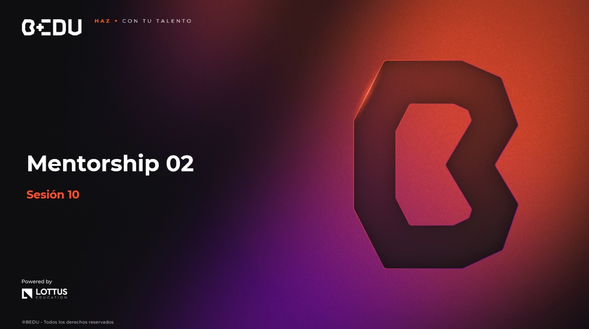

🏠 [**Inicio**](../../Readme.md) ➡️ / 📖 `Prework sesión 10`

<div align="center">
    
</div>

##### **PREWORK**
#### **🟧 Sesión 10**
#### **Mentorship 2**

##### 🔶 **Introducción** 

Llegaste a la meta final de este módulo de Java Standard Edition II! 🎉

Atrás quedaron las primeras líneas de código con `System.out.println`, y hoy estás a punto de cerrar un ciclo de aprendizaje avanzado, donde cada tema que exploraste te acercó a construir aplicaciones modernas, robustas y escalables, como las que se usan en empresas reales. 🏢💻  

A lo largo de estas 8 sesiones, recorriste un camino que comenzó con gestionar datos en bases relacionales, luego te adentraste en el mundo de la concurrencia y la asincronía, aprendiste a procesar flujos de datos de manera funcional y reactiva, construiste microservicios modulares y, finalmente, abrazaste las buenas prácticas que distinguen a los desarrolladores profesionales.  

Cada tema fue como una herramienta nueva que sumaste a tu cinturón de habilidades 🧰. 

Hoy, este prework es el mapa que conecta esas herramientas, mostrando cómo encajan entre sí y cómo puedes aplicarlas juntas en proyectos reales.  

Piensa en esta sesión como ese momento en el que miras atrás y ves todo lo que has construido. 🚀  

- 🔗 Bases de datos para guardar la información.
- 🧵 Concurrencia y asincronía para que tu app nunca se quede esperando.
- 🔄 Programación funcional y reactiva para procesar datos de forma elegante y eficiente.
- 🏗️ Microservicios para que tu sistema sea modular y escalable.
- 🧪 Pruebas, logs y control de versiones para asegurar la calidad, estabilidad y colaboración en el desarrollo.

Este prework no solo te ayudará a repasar cada pieza del rompecabezas, sino también a conectar los puntos entre las tecnologías y buenas prácticas que aprendiste. Porque el conocimiento aislado es útil, pero el conocimiento conectado es lo que te permite crear soluciones completas.

---

#### 🎯 Objetivo  

- Consolidar el conocimiento adquirido a lo largo de las 8 primeras sesiones de Java SE II, comprendiendo cómo se conectan los conceptos entre sí para construir aplicaciones.  

- Reflexionar sobre la aplicación práctica de herramientas como bases de datos, concurrencia, asincronía, programación funcional/reactiva, microservicios y buenas prácticas en el desarrollo de sistemas reales.  

- Prepararse para aplicar este conocimiento en futuros proyectos profesionales, conectando la teoría con las necesidades y retos del mundo real en el desarrollo de software.
---

#### 📋 Instrucciones

Este Prework está diseñado para conocer el contenido que se practicará durante la sesión en vivo. **Por favor no lo omitas**. Toma notas de lo que consideres relevante y guarda tus preguntas o dudas para resolverlas en la sesión.

---

#### Bienvenido/a

Bienvenid@ al decimo Prework del módulo. A continuación, te presentamos el tiempo estimado de lectura por tema, para que puedas revisar todos los recursos al máximo:

| **📖 Temario**                       | **🕰️ Tiempo sugerido** |
|--------------------------------------|-------------------------|
| Tema 01. Repaso integral del modulo  | 15 min                  |

**¡Comencemos! 🏁**

---
 
#### 📚 Tema 01. Repaso integral del modulo
##### ⏳ 15 minutos de lectura.

Este es el momento de hacer una pausa y mirar en conjunto todo lo que aprendiste en Java SE II. No se trata solo de recordar, sino de entender cómo cada tema aporta a la construcción de sistemas modernos.

En este repaso, conectarás las piezas clave: bases de datos, concurrencia, asincronía, programación funcional y reactiva, microservicios y buenas prácticas.

Un cierre para reforzar lo que ya dominas y prepararte para los próximos retos. 🚀 💪🚀

**Sesión 01. Gestión de bases de datos**

En esta sesión, aprendiste a conectar Java con bases de datos usando JPA, Hibernate y Spring Boot, facilitando el acceso y manipulación de datos sin escribir SQL manualmente. Configuraste una base embebida H2 y expusiste endpoints REST para consultar y gestionar información, sentando las bases para construir aplicaciones backend modernas.

🗄️ Introducción a la conexión de bases de datos en Java
- Aprendiste las dos principales formas en las que una aplicación Java puede conectarse a una base de datos:
    - JDBC (Java Database Connectivity): El modelo tradicional donde necesitas escribir consultas SQL manualmente y gestionar las conexiones de forma explícita.
    - JPA + Hibernate (ORM): El modelo moderno que permite mapear clases Java directamente a tablas, eliminando la necesidad de escribir SQL en muchas operaciones y facilitando el trabajo con bases de datos desde un enfoque orientado a objetos.

Conociste los conceptos clave de entidad, repositorio y persistencia, esenciales para automatizar las operaciones CRUD (Crear, Leer, Actualizar, Eliminar) en las bases de datos.

⚙️ Configuración de base de datos y entorno de desarrollo
- Configuraste un entorno de trabajo completo para desarrollar aplicaciones conectadas a bases de datos, utilizando:
    - H2 Database: Una base embebida, ideal para pruebas rápidas, sin necesidad de instalar un sistema de bases de datos externo.
    - Maven: El gestor de dependencias que facilita la integración de librerías como Spring Boot Starter Data JPA y H2.
    - Archivo `application.properties`: Donde definiste la configuración de la conexión a la base de datos, como la URL, el driver, las credenciales y el comportamiento de Hibernate (ddl-auto=update), permitiendo que las tablas se creen o actualicen automáticamente.

Esta configuración te permitió tener una base de datos lista para usar en minutos, enfocándote en el desarrollo sin complicaciones técnicas.

🌐 Conexión a una base de datos desde una aplicación web
- Construiste un flujo completo de persistencia y consulta de datos usando Spring Boot, estructurando la aplicación en capas:
    - Entidad: Define la estructura de los datos.
    - Repositorio: Facilita operaciones CRUD sin escribir SQL.
    - Servicio: Contiene la lógica de negocio para manejar los datos.
    - Controlador: Expone la API mediante endpoints REST, permitiendo interactuar con la base de datos desde el navegador o Postman.

Finalmente, probaste el endpoint `/estudiantes` con Postman, comprobando que tu aplicación podía consultar y devolver datos en formato JSON, cerrando el ciclo desde la base de datos hasta la interfaz de prueba.

> Esta sesión fue el punto de partida para conectar Java con bases de datos de forma profesional, entendiendo cómo estructurar aplicaciones y automatizar operaciones CRUD. Con estas bases, abriste la puerta al desarrollo de sistemas robustos y escalables.

---

**Sesión 02: Multihilos y procesos concurrentes**  

Aprendiste a ejecutar múltiples tareas simultáneas en Java mediante hilos y concurrencia, combinando técnicas básicas (`Thread`, `Runnable`) y avanzadas (`ExecutorService`, `Callable`, `Future`). Además, conociste cómo evitar errores en el acceso a recursos compartidos usando mecanismos de sincronización.

🔄 Introducción a la concurrencia
- Comprendiste qué es la concurrencia: la capacidad de una aplicación para manejar múltiples tareas al mismo tiempo (o de forma intercalada).  

- Conociste los conceptos clave:
    - Proceso: Programa en ejecución con su propio espacio de memoria.
    - Hilo (Thread): Subunidad dentro de un proceso que permite ejecutar tareas simultáneamente.

- Aprendiste el ciclo de vida de un hilo (`New → Runnable → Running → Blocked → Dead`) y los métodos esenciales:
    - `start()`: Inicia un hilo.
    - `run()`: Define la tarea que ejecuta el hilo.
    - `sleep()`: Pausa temporalmente un hilo.
    - `join()`: Hace que un hilo espere a otro antes de continuar.

Estos conceptos sentaron las bases para comprender cómo las tareas concurrentes mejoran la respuesta de las aplicaciones.

⚙️ Creación de hilos en Java
- Viste las formas básicas de crear hilos:
    - Clase `Thread`: Extendiendo la clase y sobreescribiendo el método `run()`.
    - Interfaz `Runnable`: Definiendo la tarea como una expresión lambda, ideal para programación funcional.

- ExecutorService y Callable:
    - Aprendiste a manejar pools de hilos con ExecutorService, evitando la creación manual de hilos.
    - Usaste Callable para lanzar tareas que devuelven resultados y Future para obtener esos resultados en el futuro.

Ejemplo de uso:

```java
ExecutorService executor = Executors.newFixedThreadPool(2);
Callable<Integer> tarea = () -> 42;
Future<Integer> resultado = executor.submit(tarea);
System.out.println(resultado.get());  // Devuelve 42
```

Este tema te permitió organizar mejor la ejecución de múltiples tareas, con herramientas modernas que facilitan la gestión de hilos y resultados.

🔐 Sincronización de hilos
- Aprendiste sobre condiciones de carrera, que ocurren cuando varios hilos acceden al mismo recurso al mismo tiempo, provocando resultados impredecibles.
- Conociste el uso de synchronized para proteger secciones críticas del código, garantizando que solo un hilo a la vez acceda a determinados bloques o métodos.

Ejemplo:

```java
public synchronized void incrementar() {
    valor++;
}
```
Exploraste mecanismos de control más avanzados:
- Locks y ReentrantLock: Alternativas a synchronized que ofrecen mayor control.
- `wait()` y `notify()`: Permiten que un hilo espere y otro lo despierte, facilitando la comunicación entre hilos (patrones como productor-consumidor).

Este tema te preparó para controlar el acceso concurrente a los recursos compartidos, evitando errores aleatorios y bloqueos.

> Ahora dominas las herramientas para gestionar procesos paralelos y controlar el acceso a los recursos, permitiendo desarrollar aplicaciones que responden mejor ante múltiples tareas simultáneas.

---

**Sesión 03. Programación funcional**

Aprendiste a aplicar principios de la programación funcional en Java para escribir código más claro, predecible y expresivo. Usaste funciones puras, lambdas, interfaces funcionales y Optional para mejorar la gestión de valores nulos. También trabajaste con la Stream API para transformar y procesar colecciones de manera fluida, y conociste cómo componer funciones para crear procesos más complejos y reutilizables.  

🧠 Fundamentos del paradigma funcional  
- Conociste qué es una función pura: aquella que devuelve siempre el mismo resultado si recibe los mismos argumentos y no genera efectos secundarios.  
- Exploraste conceptos clave:  
    - Estado inmutable: los datos no cambian, sino que se crean nuevas versiones.  
    - Interfaz funcional: una interfaz con un solo método abstracto (ej. `Predicate`, `Function`, `Consumer`).  

- Usaste lambdas y referencias a métodos para definir funciones de forma compacta y flexible. Ejemplo de lambda:  

```java
nombres.forEach(nombre -> System.out.println(nombre));
```

🛡️ Optional y Streams básicos  
- Aplicaste Optional como alternativa para evitar errores por valores nulos (`NullPointerException`), asegurando que los valores se manejen de forma segura:  

```java
Optional<String> nombre = Optional.ofNullable(obtenerNombre());
nombre.ifPresent(n -> System.out.println(n.toUpperCase()));
```

- Procesaste listas usando la Stream API, encadenando operaciones como `filter`, `map`, y `forEach` para transformar colecciones sin escribir bucles. Ejemplo con Stream:  

```java
nombres.stream()
       .filter(nombre -> nombre.length() > 3)
       .map(String::toUpperCase)
       .forEach(System.out::println);
```

🔗 Composición funcional en Java  
- Aprendiste a encadenar funciones usando `andThen()` y `compose()` para construir procesos complejos a partir de funciones simples. Ejemplo:  

```java
Function<Integer, Integer> multiplicarPor2 = x -> x * 2;
Function<Integer, Integer> sumar3 = x -> x + 3;

Function<Integer, Integer> combinado = multiplicarPor2.andThen(sumar3);
System.out.println(combinado.apply(5));  // Resultado: 13
```

Usaste `flatMap` para transformar estructuras anidadas, como listas de listas, en un solo flujo de datos:  

```java
listas.stream()
     .flatMap(Collection::stream)
     .forEach(System.out::println);
```

> Incorporaste una forma diferente de escribir código, enfocada en transformar datos de manera fluida y segura, mejorando la legibilidad y reduciendo errores. Aprendiste a pensar en funciones como piezas reutilizables que se combinan para crear procesos claros y ordenados.    

---

**Sesión 04. Procesos asíncronos**  
Aprendiste a manejar tareas que tardan sin detener el flujo de ejecución, aplicando asincronía para que las aplicaciones puedan seguir funcionando mientras esperan respuestas externas o completan operaciones largas. Usaste `CompletableFuture` para lanzar y encadenar procesos en segundo plano, manejar errores de manera fluida y combinar tareas, mejorando la experiencia y respuesta de los sistemas.  

⚡ Asincronía vs concurrencia  
- Diferencias clave:  
    - Concurrencia: Ejecutar varias tareas al mismo tiempo, turnándose o en hilos separados.  
    - Asincronía: Lanzar una tarea, seguir trabajando y recoger el resultado después, sin bloquear el flujo.  

- Conociste conceptos como:  
    - Latencia: Tiempo que tarda una operación en completarse.
    - Tareas bloqueantes vs no bloqueantes:  
        - Bloqueante → el sistema espera a que la tarea termine.  
        - No bloqueante → el sistema sigue ejecutando otras acciones mientras espera.  

- Identificaste cuándo usar hilos (concurrencia), asincronía, o una combinación de ambos, dependiendo del tipo de operación (ej. múltiples usuarios vs llamadas a servicios externos).  

🔗 Uso de `CompletableFuture`  
- Implementaste tareas asíncronas con `CompletableFuture`, permitiendo lanzar procesos en segundo plano sin detener la aplicación.  

- Aprendiste a encadenar acciones con métodos como:  

    - `thenApply()`: Transforma el resultado.  
    - `thenAccept()`: Consume el resultado.  
    - `thenCompose()`: Encadena otra tarea asíncrona.  

- Manejaste errores de forma elegante usando `exceptionally`, asegurando que las fallas no detengan el flujo de la aplicación.  

🌐 Aplicaciones prácticas  
- Aplicaste asincronía en operaciones I/O:  
    - Simulaste escritura de archivos y consultas a servicios externos sin bloquear el hilo principal.  

- Usaste combinaciones de tareas (`thenCombine`) para coordinar múltiples procesos en paralelo y combinar sus resultados cuando ambas tareas terminan.  
- Conociste buenas prácticas:  
    - Usar asincronía en tareas lentas o externas.  
    - Controlar el número de tareas para no saturar recursos.  
    - Manejar timeouts y errores en todas las operaciones.  


> Integraste asincronía en tus procesos, permitiendo que las aplicaciones sigan respondiendo mientras completan tareas complejas en segundo plano, mejorando la fluidez y respuesta del sistema.  

---

**Sesión 05.  Stream Reactivos**  

Aprendiste a procesar flujos de datos continuos de forma asíncrona y no bloqueante usando programación reactiva. Conociste los conceptos de Mono y Flux para manejar uno o muchos elementos, exploraste cómo transformar esos flujos con operadores como `map`, `flatMap`, `filter`, y aplicaste backpressure para evitar que el sistema se sature cuando llegan grandes volúmenes de datos  

🔄 Introducción a programación reactiva  

- Entendiste la diferencia entre Streams tradicionales y programación reactiva:  
    - Stream tradicional → Procesa colecciones finitas de forma sincrónica.  
    - Programación reactiva → Procesa flujos continuos o infinitos de datos de manera asíncrona y no bloqueante.  
- Conociste los principios del Reactive Manifesto:  
    - Responsivo, resiliente, elástico, orientado a mensajes.  
- Ejemplo clave:  
    - Stream tradicional procesa una lista completa.  
    - Flux (reactivo) procesa eventos que llegan en tiempo real (usuarios conectados, mensajes, sensores).  

⚙️ Project Reactor / RxJava  
- Usaste Project Reactor (integrado en Spring) y RxJava para crear flujos reactivos.  
- Mono:  
    - Flujos que emiten 0 o 1 valor.  
    - Útil para respuestas únicas (ej. una consulta a una API).  

- Flux:  
    - Flujos que emiten 0, 1 o muchos valores (potencialmente infinitos).  
    - Útil para manejar eventos continuos (mensajes, sensores, usuarios conectados).  

- Aplicaste operadores:  
    - `map`, `filter`: Transforman o filtran datos.  
    - `flatMap`: Combina flujos de datos.  

- Ejemplo clave:  
    - Flux.just(1,2,3) → procesa cada elemento de forma fluida.  

🛡️ Manejo avanzado de flujos  
- Implementaste backpressure para regular la velocidad del flujo de datos:
    - `limitRate(n)`: Procesa solo n elementos a la vez.  
    - `onBackpressureBuffer()`: Almacena datos si el consumidor va más lento.  
    - `onBackpressureDrop()`: Descarta datos que no alcanzan a procesarse.  

- Conociste el encadenamiento de operaciones para transformar flujos de forma ordenada y fluida.  

- Aplicaciones reales:  
    - Microservicios que manejan múltiples solicitudes.  
    - Sistemas de mensajería (Kafka, RabbitMQ).  
    - Monitoreo de sensores (IoT).  
    - Streams de video, chat, juegos en línea.  


> Aprendiste a procesar datos continuos y asíncronos con control sobre el flujo, manteniendo las aplicaciones adaptables ante picos de carga. Usaste Mono y Flux para manejar diferentes tipos de flujos y aplicaste backpressure para asegurar que el sistema responda fluidamente, sin saturarse.  

---

**Sesión 06. Clases genéricas**

Exploraste cómo escribir código flexible y seguro usando genéricos en Java, permitiendo que clases, métodos y estructuras funcionen con diferentes tipos de datos sin duplicar código. Aplicaste wildcards (`?`, `extends`, `super`) para ampliar o limitar esa flexibilidad, y conociste cómo diseñar componentes reutilizables que mantienen la seguridad en tiempo de compilación.  

📦 Introducción a los genéricos en Java  
- Comprendiste qué son los genéricos: estructuras que permiten trabajar con cualquier tipo de dato, sin perder seguridad de tipos.  
- Sintaxis clave:  
    - `<T>`, `<E>`, `<K, V>` → parámetros genéricos para representar tipos flexibles.  

- Ejemplo simple de clase genérica:  

```java
public class Caja<T> {
    private T contenido;
    public void guardar(T contenido) { this.contenido = contenido; }
    public T obtener() { return contenido; }
}
```

- Ventajas:  
    - Evitas casting manual.  
    - Seguridad en compilación (detectas errores antes de ejecutar).  
    - Reutilización de código para diferentes tipos.  

🔗 Wildcards y restricciones  
Conociste los wildcards (`?`) para ampliar la flexibilidad en colecciones:  


| Wildcard	       | ¿Qué permite?        | Ejemplo|
|------------------|----------------------|---------|
| `?`              | Cualquier tipo	      | `List<?>` | 
| `? extends Tipo` | Subtipos de un tipo  | `List<? extends Number>` | 
| `? super Tipo`   | Supertipos de un tipo | `List<? super Integer>` | 

- Uso práctico:  
    - `? extends` → Cuando solo necesitas leer datos.  
    - `? super` → Cuando necesitas agregar datos.  

- Aplicaste restricciones en genéricos para limitar qué tipos se aceptan:  

```java
public class CajaNumeros<T extends Number> { ... }
```
Esto garantiza que solo se usen tipos numéricos (como Integer, Double).  

🛠️ Aplicaciones comunes
- Aplicaste genéricos para evitar castings y mejorar la seguridad del código:  

```java
List<String> lista = new ArrayList<>();
```

- Diseñaste clases reutilizables (como repositorios, validadores) que funcionan para diferentes tipos de datos:  

```java
public class Repositorio<T> { ... }
```

- Usaste restricciones de tipos (`<T extends Number>`) para asegurar que ciertos componentes solo acepten tipos compatibles.  

- Aplicaciones reales:  
    - Repositorios en microservicios para manejar distintas entidades.  
    - Validadores genéricos para listas o entradas.  
    - Colecciones en APIs (ej. `List<Producto>`).  

> Aplicaste genéricos para diseñar componentes flexibles y seguros, evitando duplicar código y asegurando que los tipos se validen en tiempo de compilación. Conociste wildcards para ajustar la flexibilidad según el contexto, facilitando la reutilización y adaptabilidad del código en proyectos de cualquier tamaño.  

---

**Sesión 07. Microservicios**

Descubriste cómo dividir un sistema grande en servicios pequeños, independientes y especializados, entendiendo las diferencias entre arquitectura monolítica y microservicios. Aprendiste a crear una API REST básica usando Spring Boot, y exploraste las formas en que los microservicios se comunican entre sí de manera síncrona (REST) y asíncrona (mensajería).  


🧩 Arquitectura de microservicios  
- Entendiste qué es un microservicio: un módulo independiente con su propia lógica y, opcionalmente, su propia base de datos.  
- Comparaste monolitos vs microservicios:  
    - Monolito: Todo está conectado y despliegas el sistema completo.  
    - Microservicios: Cada servicio puede actualizarse, escalarse o fallar de manera aislada.  

- Ventajas:
    - Despliegue independiente.  
    - Escalabilidad granular.  
    - Mejor tolerancia a fallos.  
    - Flexibilidad tecnológica.  

- Desventajas:  
    - Complejidad en la comunicación.  
    - Mayor esfuerzo operativo.  
    - Sincronización de datos entre servicios.  

- Casos de éxito: Netflix, Amazon y Spotify usan microservicios para manejar sistemas altamente dinámicos y de gran volumen.  

⚙️ Introducción a Spring Boot  
- Conociste Spring Boot como el framework que simplifica el desarrollo de APIs REST en Java:  
    - Configuración automática.  
    - Servidor embebido listo para usarse (Tomcat, Jetty).  
    - Starters: paquetes preconfigurados para conectar bases de datos, exponer servicios web, manejar seguridad, etc.  

- Creaste un servicio web sencillo en minutos usando:  
    - Dependencias en Maven (`spring-boot-starter-web`).  
    - Anotaciones como `@SpringBootApplication` y `@RestController`.  
    - Servidor embebido ejecutándose directamente al iniciar el proyecto.  

- Aplicación práctica:  
    - Cada microservicio puede ser un proyecto Spring Boot independiente, corriendo en diferentes puertos.  

🔗 Comunicación entre servicios  
- Comunicación síncrona (REST):  
    - Un servicio realiza una solicitud HTTP (GET, POST) y espera una respuesta inmediata.  
    - Uso típico: Validar pagos, verificar stock.  

- Comunicación asíncrona (mensajería):  
    - Un servicio envía un mensaje a una cola (RabbitMQ, Kafka) y otro servicio lo procesa cuando puede.  
    - Uso típico: Registro de logs, envío de correos, procesamiento de eventos.  

- Herramientas prácticas:  
    - RestTemplate para llamadas HTTP entre microservicios.  
    - Alternativas modernas: WebClient, FeignClient.  

- Decidir entre REST o mensajería depende de si necesitas respuesta inmediata o puedes procesar en segundo plano.  

> Comprendiste cómo modularizar aplicaciones complejas mediante microservicios, utilizando Spring Boot para construir APIs independientes y explorando diferentes formas de comunicación para mantener la colaboración entre servicios de manera fluida y adaptable a distintos escenarios.  

---

**Sesión 08. Buenas prácticas y manejo de errores en Java**  

Aprendiste a aplicar convenciones de diseño, pruebas unitarias, depuración y control de versiones para construir proyectos de mayor calidad, organización y mantenibilidad. Conociste herramientas como JUnit 5, Mockito, SLF4J y Git, y entendiste la importancia de escribir código que no solo funcione, sino que sea legible, probado y controlado.  

🧹 Principios de diseño en Java  
- Entendiste que un buen diseño no solo hace que el código funcione, sino que sea comprensible y sostenible a largo plazo.  
- Aplicaste:  
    - Convenciones de código (nombres de clases, métodos, variables y constantes).  
    - Refactorización: Mejorar la estructura interna del código sin cambiar su funcionalidad.  
    - Patrones de diseño (ej. Singleton) para resolver problemas comunes de forma estructurada.  
- Reflexionaste sobre cómo refactorizar continuamente y adoptar patrones evita que el código se vuelva difícil de mantener.  

🧪 Pruebas unitarias y depuración  
- Implementaste pruebas unitarias con JUnit 5:  
    - Validación de excepciones.  
    - Pruebas parametrizadas para reducir duplicación de código.  

- Usaste Mockito para crear mocks que permiten probar componentes de forma aislada, simulando sus dependencias.  
- Aplicaste buenas prácticas de logging con SLF4J, entendiendo:  
    - La importancia de niveles de logs (`debug`, `info`, `warn`, `error`).  
    - Cómo agregar contexto relevante para facilitar la depuración.  
- Conectaste la importancia de automatizar las pruebas y registrar eventos de ejecución para mejorar la detección de errores en todas las fases del desarrollo.  

🔗 Organización del código y control de versiones  
- Aprendiste a organizar proyectos Java siguiendo una estructura por capas:
    - controller, service, repository, model.  

- Implementaste buenas prácticas de Git:  
    - Crear ramas para nuevas funcionalidades.  
    - Hacer commits pequeños y descriptivos.  
    - Usar Pull Requests para revisión de cambios.  
    - Mantener un flujo limpio y ordenado de integración de código.  

- Entendiste cómo un buen uso de Git facilita el trabajo en equipo y permite manejar proyectos de cualquier tamaño sin caos.  

> Incorporaste prácticas esenciales para que tus proyectos sean más claros, probados y organizados, facilitando su crecimiento y colaboración en equipos. Aprendiste a integrar diseño, pruebas, logs y control de versiones como parte natural de tu flujo de desarrollo.  

---

#### 📝 Cierre  

¡Felicidades por completar este recorrido en Java SE II! 🏁  

A lo largo de estas sesiones, expandiste tu conocimiento en áreas clave:
🗄️ Bases de datos, 🔄 Procesos concurrentes, 🧩 Programación funcional, 🌐 Programación reactiva, 🛠️ Microservicios, 🧪 Pruebas unitarias y 📝 Control de versiones.  

Cada tema representa una nueva herramienta en tu kit profesional 🧰, fortaleciendo tu capacidad para construir aplicaciones claras, seguras y bien estructuradas.  

#### 🎯 Gracias por tu tiempo, dedicación y apertura al aprendizaje.  

Cada esfuerzo que realizaste demuestra tu compromiso y tu visión de crecimiento en el mundo del desarrollo de software. 🙌  

Valoramos profundamente tu disposición para **aprender, practicar y conectar ideas**. 💡  
Avanzaste en tu camino profesional con paso firme, enfrentando nuevos conceptos y plasmándolos en proyectos reales.  

🎓 ¡Hoy celebramos el conocimiento que construiste!  

Cada línea de código, cada prueba ejecutada y cada microservicio diseñado es una evidencia tangible de tu avance. 📈✨  

Así que respira, repasa, reflexiona... ¡y prepárate para cerrar con fuerza este módulo! 🚀  

---

⬅️ [**Anterior**](../../Sesion-09/Prework/Readme.md)

