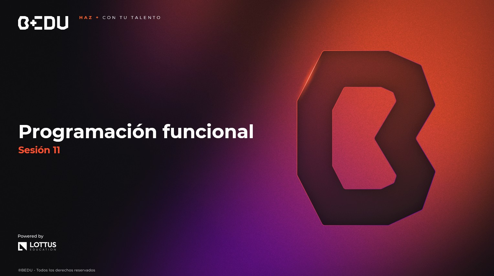

🏠 [**Inicio**](../Readme.md) ➡️ / 📖 `Sesión 11`

    

# 🎯 Objetivo

⚒️ Comprender los fundamentos de la programación funcional en Java, identificar las ventajas del uso de funciones puras, `Optional`, `Stream API` y composición funcional para escribir código más conciso, expresivo y menos propenso a errores.

---

📘 Material del prework:  
Antes de comenzar con los ejercicios de esta sesión, recordemos que en el material de prework hemos cubierto los fundamentos teóricos que aplicaremos hoy. A lo largo de esta sesión, pondremos en práctica estos conceptos mediante una serie de ejercicios y retos diseñados para reforzar y validar nuestro entendimiento.  
🔥¡Vamos a comenzar!🔥

---

## 📂 Temas de la sesión...

### 📖 Fundamentos del paradigma funcional  
Introducción a la programación funcional y sus diferencias frente al paradigma imperativo tradicional.

🔹 **Funciones puras y estado inmutable**  
🔹 **Expresiones lambda y referencias a métodos**  
🔹 **Interfaces funcionales (`Predicate`, `Function`, `Consumer`, etc.)**

📜 **[Ejemplo 01: Uso de lambdas y funciones puras](Ejemplo-01/Readme.md)**  

---

### 📖 Optional y Streams básicos  
Uso de clases e interfaces funcionales para evitar errores comunes como `NullPointerException` y facilitar operaciones con colecciones.

🔹 **Prevención de nulls con `Optional`**  
🔹 **Operaciones con `Stream API`: `map`, `filter`, `forEach`**  
🔹 **Operaciones terminales y composición de transformaciones**

📜 **[Ejemplo 02: Uso de Optional y transformaciones con Stream](Ejemplo-02/Readme.md)**  
🔥 **[Reto 01: Confirmación segura de pedidos en una pizzería](Reto-01/Readme.md)**  

---

### 📖 Composición funcional en Java  
Aprender a combinar funciones, transformar estructuras complejas y aplicar buenas prácticas para un código más declarativo.

🔹 **Encadenamiento de funciones**  
🔹 **Uso de `flatMap` y composición avanzada**  
🔹 **Buenas prácticas en programación funcional**

📜 **[Ejemplo 03: Composición funcional con flatMap y Function](Ejemplo-03/Readme.md)**  
🔥 **[Reto 02: Cadena funcional para procesamiento de encuestas en una clínica](Reto-02/Readme.md)**  

---

⬅️ [**Anterior**](../Sesion-10/Readme.md) | [**Siguiente**](../Sesion-12/Readme.md)➡️  